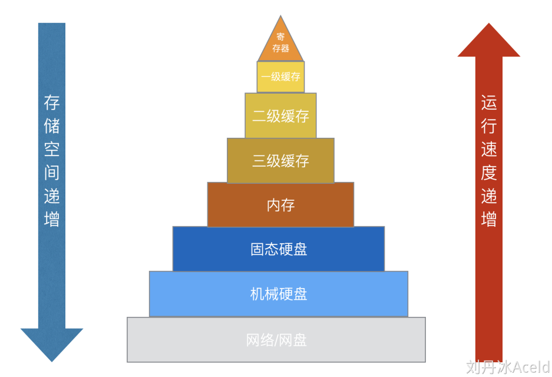
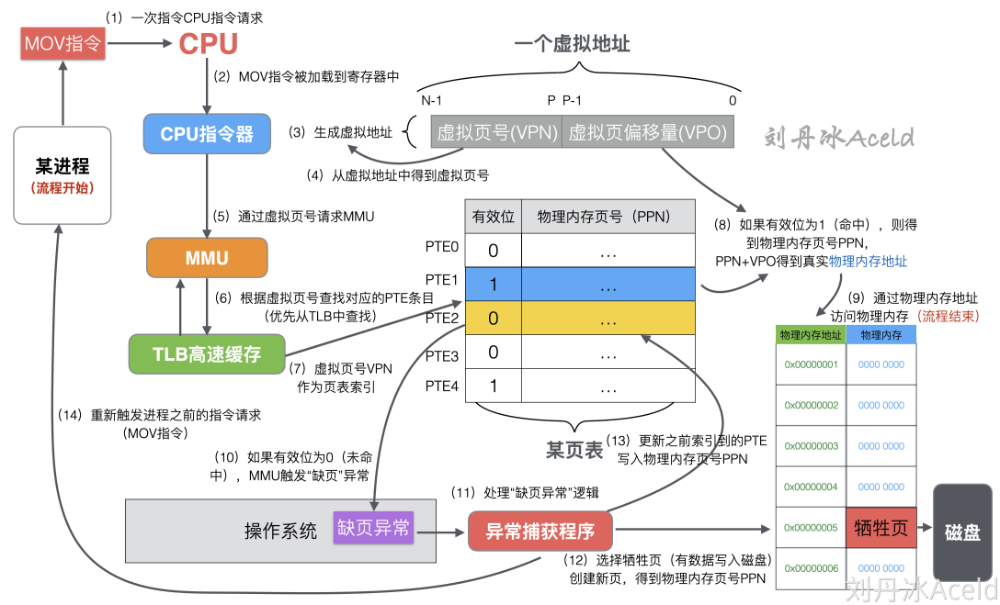

# 存储

上一层均可看做下一层的缓存
## 虚拟内存
虚拟内存地址是基于物理内存地址之上凭空而造的一个新的逻辑地址，而操作系统暴露给用户进程的只是虚拟内存地址，操作系统内部会对虚拟内存地址和真实的物理内存地址做映射关系，来管理地址的分配，从而使物理内存的利用率提高
每一个程序统一使用一套连续虚拟地址，它觉得自己独享了一整块内存，且不用考虑访问冲突的问题。系统会将虚拟地址翻译成物理地址，从内存上加载数据
虚拟内存可以解决以下问题：
* 物理内存无法被最大化利用（读时共享，写时复制）
* 程序逻辑内存空间使用独立
* 内存不够，继续虚拟磁盘空间
* 向进程屏蔽底层RAM和磁盘，并向进程提供远超物理内存的内存空间
* 若无虚拟内存，物理内存对所有进程共享，多进程访问物理内存时存在并发问题
* 引入虚拟内存后，进程独享各自的虚拟内存，并发问题降低到线程级别
### 存储机制
* 页是操作系统中用来描述内存大小的一个单位名称。一个页的含义是大小为4K（1024*4=4096字节）的内存空间。操作系统对虚拟内存空间是按照这个单位来管理的
* 页表实际上就是页的集合，就是基于页的一个数组。页只是表示内存的大小，而页表条目（PTE[1]）, 才是页表数组中的一个元素
* CPU 把虚拟地址给MMU，MMU去物理内存中查询页表，得到实际的物理地址。当然 MMU 不会每次都去查的，它自己也有一份缓存叫Translation Lookaside Buffer (TLB)[2]，是为了加速地址翻译
一次CPU访问内存的详细流程：

（1）进程将内存相关的寄存器指令请求运算发送给CPU，CPU得到具体的指令请求。
（2）计算指令被CPU加载到寄存器当中，准备执行相关指令逻辑。
（3）CPU对相关可能请求的内存生成虚拟内存地址。一个虚拟内存地址包括虚拟页号VPN（Virtual Page Number）和虚拟页偏移量VPO（Virtual Page Offset）[3]。
（4）从虚拟地址中得到虚拟页号VPN。
（5）通过虚拟页号VPN请求MMU内存管理单元。
（6）MMU通过虚拟页号查找对应的PTE条目（优先层TLB缓存查询）。
（7）通过得到对应的PTE上的有效位来判断当前虚拟页是否在主存中。
（8）如果索引到的PTE条目的有效位为1，则表示命中，将对应PTE上的物理页号PPN（Physical Page Number）和虚拟地址中的虚拟页偏移量VPO进行串联从而构造出主存中的物理地址PA（Physical Address）[4]，进入步骤（9）。
（9）通过物理内存地址访问物理内存，当前的寻址流程结束。
（10）如果有效位为0，则表示未命中，一般称这种情况为缺页。此时MMU将产生一个缺页异常，抛给操作系统。
（11）操作系统捕获到缺页异常，开始执行异常处理程序。
（12）此时将选择一个牺牲页并将对应的所缺虚拟页调入并更正新页表上的PTE，如果当前牺牲页有数据，则写入磁盘，得到物理内存页号PPN（Physical Page Number）。
（13）缺页处理程序更新之前索引到的PTE，并且写入物理内存怒页号PPN，有效位设置为1。
（14）缺页处理程序再次返回到原来的进程，且再次执行缺页指令，CPU重新将虚拟地址发给MMU，此时虚拟页已经存在物理内存中，本次一定会命中，通过（1）~（9）流程，最终将请求的物理内存返回给处理器。
### 内存局部性
局部性就是在多次内存引用的时候，会出现有的内存被经常引用多次，而且在该位置附近的其他位置，也有可能接下来被引用到
## 栈和堆

* 栈在高地址，从高地址向低地址增长
* 堆在低地址，从低地址向高地址增长
* 栈的内存管理简单，分配比堆上快
* 栈的内存不需要回收，而堆需要
* 栈上的内存访问有更好的局部性
## 堆内存管理

* size：内存块大小
* used：是否使用中
* next：下一个内存块地址
* data：实际数据
堆内存最初为一整块，即未分配内存。当申请到来，分配一个内存卡（block），然后用链表串起内存块

* 释放内存：把使用的内存块从链表中取出来，然后标记为未使用
* 分配内存：优先从未使用内存块中分配大小相近的内存块，找不到，再从未分配内存中分配
* 内存碎片问题：将连续未使用的内存块合并