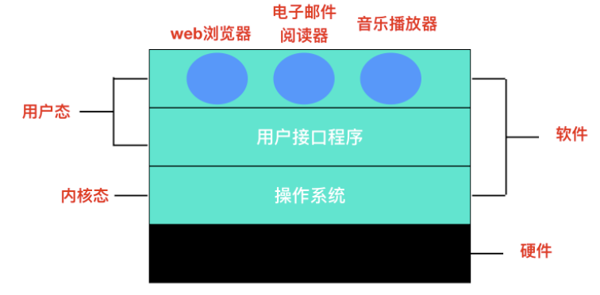
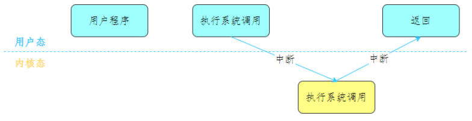
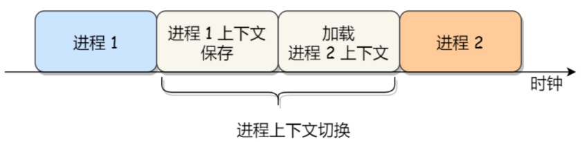
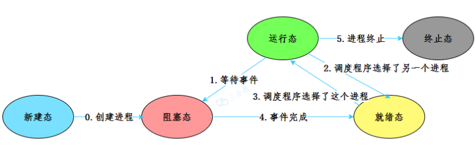
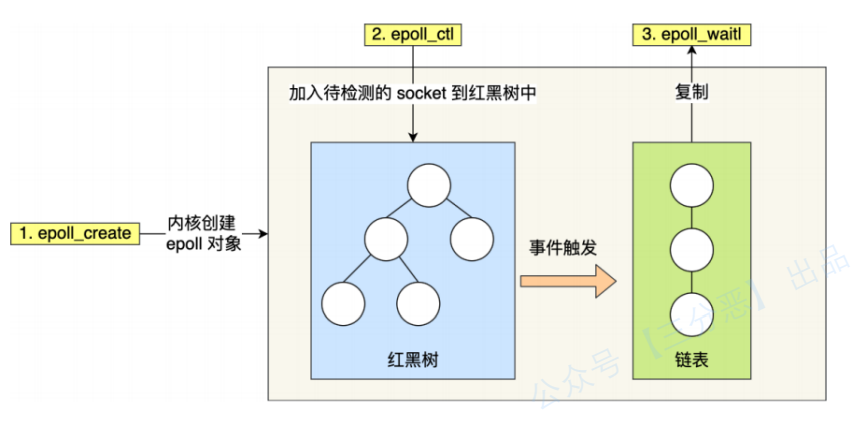

# 操作系统
操作系统是⼀种运⾏在内核态的软件。
是应⽤程序和硬件之间的媒介，向应⽤程序提供硬件的抽象，以及管理硬件资源。

操作系统最主要的功能：

* 处理器（CPU）管理：CPU的管理和分配，主要指的是进程管理。
* 内存管理：内存的分配和管理，主要利⽤了虚拟内存的⽅式。
* 文件管理：外存（磁盘等）的分配和管理，将外存以⽂件的形式提供出去。
* 设备管理：根据确定的设备分配原则对设备进行分配。
* I/O管理：对输⼊/输出设备的统⼀管理。

## 内核
内核：⼀个计算机程序，它是操作系统的核⼼，提供了操作系统最核⼼的能⼒，可以控制操作系统中所有的内容。

内核具有很⾼的权限，可以控制 cpu、内存、硬盘等硬件，出于权限控制的考虑，因此⼤多数操作系统，把内存分成了两个区域：

* 内核空间，这个内存空间只有内核程序可以访问；
* ⽤户空间，这个内存空间专⻔给应⽤程序使⽤，权限⽐较⼩；

应⽤程序如果需要进⼊内核空间，就需要通过系统调⽤，来进⼊内核态：

## 进程和线程
并发：在⼀段时间内，多个任务都会被处理；但在某⼀时刻，只有⼀个任务在执⾏。
并⾏：在同⼀时刻，有多个任务在执⾏。

### 进程上下文切换
上下⽂切换 (Context Switch) ：将 CPU 资源从⼀个进程分配给另⼀个进程的机制。在切换的过程
中，操作系统需要先存储当前进程的状态 (包括内存空间的指针，当前执⾏完的指令等等)，
再读⼊下⼀个进程的状态，然后执⾏此进程。

### 状态切换
* 创建状态（ new ）：进程正在被创建时的状态；
* 运⾏状态（ Runing ）：该时刻进程占⽤ CPU；
* 就绪状态（ Ready ）：可运⾏，由于其他进程处于运⾏状态⽽暂时停⽌运⾏。
* 阻塞状态（ Blocked ）：该进程正在等待某⼀事件发⽣（如等待输⼊/输出操作的完成）⽽暂时停⽌运⾏，这时，即使给它CPU控制权，它也⽆法运⾏；
* 结束状态（ Exit ）：进程正在从系统中消失时的状态

### 调度算法
进程调度就是确定某⼀个时刻CPU运⾏哪个进程

#### 先来先服务
* ⾮抢占式的调度算法，按照请求的顺序进⾏调度。
* 有利于长作业，但不利于短作业。
* 对I/O密集型进程不利，进程每次进⾏I/O操作之后又得重新排队。

#### 短作业优先
* ⾮抢占式的调度算法，按估计运⾏时间最短的顺序进⾏调度。
* 长作业有可能会饿死，处于⼀直等待短作业执⾏完毕的状态。

#### 优先级调度
为每个进程分配⼀个优先级，按优先级进⾏调度。为了防⽌低优先级的进程永远等不到调度，可以随着时间的推移增加等待进程的优先级。

#### 时间片轮转
将所有就绪进程按 先来先服务的原则排成⼀个队列，每次调度时，把 CPU 时间分配给队⾸进程，该进程可以执⾏⼀个时间⽚。当时间⽚⽤完时，由计时器发出时钟中断，调度程序便停⽌该进程的执⾏，并将它送往就绪队列的末尾，同时继续把 CPU 时间分配给队⾸的进程。

时间⽚轮转算法的效率和时间⽚的⼤⼩有很⼤关系：因为进程切换都要保存进程的信息并且载⼊新进程的信息，如果时间⽚太⼩，会导致进程切换得太频繁，在进程切换上就会花过多时间。 ⽽如果时间⽚过长，那么实时性就不能得到保证。

#### 最短剩余时间优先
最短作业优先的抢占式版本，按剩余运⾏时间的顺序进⾏调度。 当⼀个新的作业到达时，其整个运⾏时间与当前进程的剩余时间作⽐较。如果新的进程需要的时间更少，则挂起当前进程，运⾏新的进程。否则新的进程等待。

### 进程间通信

#### 管道
管道：内核中的⼀串缓存，从管道的⼀端写⼊数据，就是缓存在了内核⾥，另⼀端读取，也是从内核中读取这段数据。

* 匿名管道：单向的，只能在有亲缘关系的进程间通信；
* 命名管道：双向的，可以实现本机任意两个进程通信。

#### 信号
发送⽅发送内容，指定接收进程，然后发出特定的软件中断，操作系统接到中断请求后，找到接收进程，通知接收进程处理信号。

Linux系统中常⽤信号：

* SIGHUP：⽤户从终端注销，所有已启动进程都将收到该进程。系统缺省状态下对该信号的处理是终⽌进程。
* SIGINT：程序终⽌信号。程序运⾏过程中，按Ctrl+C键将产⽣该信号。
* SIGQUIT：程序退出信号。程序运⾏过程中，按Ctrl+\键将产⽣该信号。
* SIGBUS和SIGSEGV：进程访问⾮法地址。
* SIGFPE：运算中出现致命错误，如除零操作、数据溢出等。
* SIGKILL：⽤户终⽌进程执⾏信号。shell下执⾏kill -9发送该信号。
* SIGTERM：结束进程信号。shell下执⾏kill 进程pid发送该信号。
* SIGALRM：定时器信号。
* SIGCLD：⼦进程退出信号。如果其⽗进程没有忽略该信号也没有处理该信号，则⼦进程退出后将形成僵⼫进程。

#### 消息队列
* 保存在内核中的消息链表，包括Posix消息队列和System V消息队列。
* 有⾜够权限的进程可以向队列中添加消息，
* 被赋予读权限的进程则可以读⾛队列中的消息。
* 消息队列克服了信号承载信息量少，管道只能承载⽆格式字节流以及缓冲区⼤⼩受限等缺点

#### 共享内存
* 拿出⼀块虚拟地址空间来，映射到相同的物理内存中。
* 共享内存是最快的 IPC ⽅式，它是针对其他进程间通信⽅式运⾏效率低⽽专门设计的。
* 与其他通信机制，如信号量，配合使⽤，来实现进程间的同步和通信。

#### 信号量
* ⼀个整数计数器，可以⽤来控制多个进程对共享资源的访问。
* 常作为⼀种锁机制，防⽌某进程正在访问共享资源时，其他进程也访问该资源。
* 主要作为进程间以及同⼀进程内不同线程之间的同步⼿段。

信号量表⽰资源的数量，控制信号量的⽅式有两种原⼦操作：

* P 操作 ：把信号量减去 1，相减后如果信号量 < 0，则表明资源已被占⽤，进程需阻塞等待；相减后如果信号量 >= 0，则表明还有资源可使⽤，进程可正常继续执⾏。
* V 操作：把信号量加上 1，相加后如果信号量 <= 0，则表明当前有阻塞中的进程，于是会将该进程唤醒运⾏；相加后如果信号量 > 0，则表明当前没有阻塞中的进程；

P 操作是⽤在进⼊共享资源之前，V 操作是⽤在离开共享资源之后，这两个操作是必须成对出现的。

#### Socket
与其他通信机制不同的是，可⽤于不同机器间的进程通信。

#### 对比

* 管道：简单；效率低，容量有限；
* 消息队列：不及时，写⼊和读取需要⽤户态、内核态拷贝。
* 共享内存区：能够很容易控制容量，速度快，但需要注意不同进程的同步问题。
* 信号量：不能传递复杂消息，⼀般⽤来实现进程间的同步；
* 信号：它是进程间通信的唯⼀异步机制。
* Socket：⽤于不同主机进程间的通信。

### 僵尸进程
僵⼫进程是已完成且处于终⽌状态，但在进程表中却仍然存在的进程。
僵⼫进程⼀般发⽣有⽗⼦关系的进程中，⼀个⼦进程的进程描述符在⼦进程退出时不会释放，只有当⽗进程通过 wait() 或 waitpid() 获取了⼦进程信息后才会释放。如果⼦进程退出，⽽⽗进程并没有调⽤ wait() 或 waitpid()，那么⼦进程的进程描述符仍然保存在系统中。

### 孤儿进程
⼀个⽗进程退出，⽽它的⼀个或多个⼦进程还在运⾏，那么这些⼦进程将成为孤⼉进程。孤⼉进程将被 init 进程 (进程 ID 为 1 的进程) 所收养，并由 init 进程对它们完成状态收集⼯作。因为孤⼉进程会被 init 进程收养，所以孤⼉进程不会对系统造成危害。

### 线程
线程是进程当中的⼀条执⾏流程。

同⼀个进程内多个线程之间可以共享代码段、数据段、打开的⽂件等资源，但每个线程各⾃都有⼀套独⽴的寄存器和栈，这样可以确保线程的控制流是相对独⽴的。

#### 上下文切换
* 不同进程的两个线程，切换的过程就跟进程上下⽂切换⼀样；、
* 相同进程的两个线程，因为虚拟内存是共享的，所以在切换时，虚拟内存这些资源就保持不动，只需要切换线程的私有数据、寄存器等不共享的数据 ；所以，线程的上下⽂切换相⽐进程，开销要⼩很多
* 
#### 实现方式
* 内核态线程实现 ：在内核空间实现的线程，由内核直接管理直接管理线程。
* ⽤户态线程实现 ：在⽤户空间实现线程，不需要内核的参与，内核对线程⽆感知。
* 混合线程实现 ：现代操作系统基本都是将两种⽅式结合起来使⽤。⽤户态的执⾏系统负责进程内部线程在⾮阻塞时的切换；内核态的操作系统负责阻塞线程的切换。即我们同时实现内核态和⽤户态线程管理。其中内核态线程数量较少，⽽⽤户态线程数量较多。每个内核态线程可以服务⼀个或多个⽤户态线程。

#### 线程同步
同步解决的多线程操作共享资源的问题。
##### 临界区
对共享资源访问的程序⽚段称为 临界区。

* ⼀个线程在临界区执⾏时，其它线程应该被阻⽌进⼊临界区。
* 临界区不仅针对线程，同样针对进程。

##### 锁
使⽤加锁操作和解锁操作可以解决并发线程/进程的互斥问题。

* 忙等待锁：加锁失败的线程，会不断尝试获取锁，也被称为⾃旋锁，它会⼀直占⽤CPU。
* ⽆忙等待锁：加锁失败的线程，会进⼊阻塞状态，放弃CPU，等待被调度。

##### 信号量
信号量是操作系统提供的⼀种协调共享资源访问的⽅法。通常信号量表⽰资源的数量，对应的变量是⼀个整型（ sem ）变量。

#### 线程进程比较
* 调度： 进程是资源（包括内存、打开的⽂件等）分配的单位 ， 线程是 CPU 调度的单位 ；
* 资源：进程拥有⼀个完整的资源平台，⽽线程只独享必不可少的资源，如寄存器和栈；
* 状态切换：线程同样具有就绪、阻塞、执⾏三种基本状态，同样具有状态之间的转换关系；
* 系统开销：线程能减少并发执⾏的时间和空间开销：创建或撤销进程时，系统都要为之分配或回收系统资源，如内存空间，I/O设备等，OS所付出的开销显著⼤于在创建或撤销线程时的开销，进程切换的开销也远⼤于线程切换的开销。
* 
### 死锁
在两个或者多个并发线程中，如果每个线程持有某种资源，⽽又等待其它线程释放它或它们现在保持着的资源，在未改变这种状态之前都不能向前推进，称这⼀组线程产⽣了死锁。通俗的讲就是两个或多个线程⽆限期的阻塞、相互等待的⼀种状态。

#### 死锁条件
死锁产⽣需要同时满⾜四个条件：

* 互斥条件 ：指线程对⼰经获取到的资源进⾏它性使⽤，即该资源同时只由⼀个线程占⽤。如果此时还有其它线程请求获取获取该资源，则请求者只能等待，直⾄占有资源的线程释放该资源。
* 持有并等待条件 ：指⼀个 线程⼰经持有了⾄少⼀个资源，但又提出了新的资源请求，⽽新资源⼰被其它线程占有，所以当前线程会被阻塞，但阻塞 的同时并不释放⾃⼰已经获取的资源。
* 不可剥夺条件 ：指线程获取到的资源在⾃⼰使⽤完之前不能被其它线程抢占，只有在⾃⼰使⽤完毕后才由⾃⼰释放该资源。
* 环路等待条件 ：指在发⽣死锁时，必然存在⼀个线程资源的环形链

#### 避免死锁
避免死锁，破坏其中的⼀个就可以

* 消除互斥条件：是没法实现，因为很多资源就是只能被⼀个线程占⽤，例如锁。
* 消除请求并持有条件：⼀个线程⼀次请求其所需要的所有资源。
* 消除不可剥夺条件：占⽤部分资源的线程进⼀步申请其他资源时，如果申请不到，可以主动释放它占有的资源。
* 消除环路等待条件：按序申请资源来预防。所谓按序申请，是指资源是有线性顺序的，申请的时候可以先申请资源序号⼩的，再申请资源序号⼤的，这样线性化后就不存在环路了。

#### 锁分类
饥饿锁：某个线程⼀直等不到它所需要的资源，从⽽⽆法向前推进。
活锁：处于活锁线程组⾥的线程状态可以改变，但是整个活锁组的线程⽆法推进。

## 内存管理
### 虚拟内存
* 虚拟内存是操作系统提供的⼀种机制，将不同进程的虚拟地址和不同内存的物理地址映射起来。
* 每个进程都有⾃⼰独⽴的地址空间，再由操作系统映射到到实际的物理内存。
* 程序所使⽤的内存地址叫做虚拟内存地址（Virtual Memory Address）
* 实际存在硬件⾥⾯的空间地址叫物理内存地址（Physical Memory Address）。

### 内存分段
程序是由若⼲个逻辑分段组成的，如可由代码分段、数据分段、栈段、堆段组成。不同的段是有不同的属性的，所以就⽤分段（Segmentation）的形式把这些段分离出来。

分段机制下的虚拟地址由两部分组成，段号和段内偏移量。

虚拟地址和物理地址通过段表映射，段表主要包括段号、 段的界限 。

### 内存分页
分⻚是把整个虚拟和物理内存空间切成⼀段段固定尺⼨。在 Linux 下，每⼀⻚的⼤⼩为 4KB 。
访问分页系统中内存数据需要两次的内存访问 ：⼀次是从内存中访问页表，从中找到指定的物理页号，加上页内偏移得到实际物理地址，第⼆次就是根据第⼀次得到的物理地址访问内存取出数据。

#### 多级页表
多级页表，就是把我们原来的单级页表再次分页，这⾥利⽤了 局部性原理 ，除了顶级页表，其它级别的页表⼀来可以在需要的时候才被创建，⼆来内存紧张的时候还可以被置换到磁盘中。

* 段是信息的逻辑单位，它是根据⽤户的需要划分的，因此段对⽤户是可见的 ；
* 页是信息的物理单位，是为了管理主存的⽅便⽽划分的，对⽤户是透明的。
* 段的⼤⼩不固定，有它所完成的功能决定；页的⼤⼩固定，由系统决定
* 段向⽤户提供⼆维地址空间；页向⽤户提供的是⼀维地址空间
* 段是信息的逻辑单位，便于存储保护和信息的共享，页的保护和共享受到限制
#### 页面置换
在分页系统⾥，⼀个虚拟的页⾯可能在主存⾥，也可能在磁盘中，如果CPU发现虚拟地址对应的物理页不在主存⾥，就会产⽣⼀个缺页中断，然后从磁盘中把该页调⼊主存中。
如果内存⾥没有空间，就需要从主存⾥选择⼀个页⾯来置换。

##### 最佳页面置换算法
置换在未来最⻓时间不访问的⻚⾯。
这个算法是⽆法实现的，因为当缺页中断发⽣时，操作系统⽆法知道各个页⾯下⼀次将在什么时候被访问。

##### 先进先出置换算法（FIFO）
选择在内存驻留时间很⻓的⻚⾯进⾏中置换。

##### 最近最久未使⽤的置换算法（LRU）
发⽣缺⻚时，选择最⻓时间没有被访问的⻚⾯进⾏置换，
这种算法近似最优置换算法，最优置换算法是通过「未来」的使⽤情况来推测要淘汰的⻚⾯，⽽ LRU 则是通过 历史 的使⽤情况来推测要淘汰的⻚⾯。
在理论上是可以实现的，但代价很⾼，实际应⽤中⽐较少使⽤。

##### 时钟页⾯置换算法
把所有的⻚⾯都保存在⼀个类似钟⾯的环形链表中，⼀个表针指向最⽼的⻚⾯。
当发⽣缺⻚中断时，算法⾸先检查表针指向的⻚⾯：

* 如果它的访问位位是 0 就淘汰该⻚⾯，并把新的⻚⾯插⼊这个位置，然后把表针前移⼀个位置
* 如果访问位是 1 就清除访问位，并把表针前移⼀个位置，重复这个过程直到找到了⼀个访问位为 0 的⻚⾯为⽌；

##### 最不常⽤置换算法
当发⽣缺⻚中断时，选择访问次数最少的那个⻚⾯，将其置换。
对每个⻚⾯设置⼀个「访问计数器」，每当⼀个⻚⾯被访问时，该⻚⾯的访问计数器就累加 1。在发⽣缺⻚中断时，淘汰计数器值最⼩的那个⻚⾯。

## 文件
### 链接
#### 硬链接
硬链接：在⽬录下创建⼀个条⽬，记录着⽂件名与 inode 编号，这个 inode 就是源⽂件的inode。

* 删除任意⼀个条⽬，⽂件还是存在，只要引⽤数量不为 0。
* 但是硬链接有限制，它不能跨越⽂件系统，也不能对⽬录进⾏链接。
#### 软链接
软链接相当于重新创建⼀个⽂件，这个⽂件有独⽴的 inode，但是这个⽂件的内容是另外⼀个⽂件的路径。
访问软链接的时候，实际上相当于访问到了另外⼀个⽂件，所以软链接是可以跨⽂件系统的，甚⾄⽬标⽂件被删除了，链接⽂件还是在的，只不过打不开指向的⽂件了⽽已。

## IO

### 零拷贝
假如需要⽂件传输，使⽤传统I/O，数据读取和写⼊是⽤户空间到内核空间来回赋值，⽽内核
空间的数据是通过操作系统的I/O接⼜从磁盘读取或者写⼊，这期间发⽣了多次⽤户态和内核
态的上下⽂切换，以及多次数据拷贝。
为了提升I/O性能，就需要减少⽤户态与内核态的上下⽂切换和内存拷贝的次数

#### mmap + write
mmap() 系统调⽤函数会直接把内核缓冲区⾥的数据「映射」到⽤户空间，这样，操作系统内核与⽤户空间就不需要再进⾏任何的数据拷⻉操作。

#### sendfile
专⻔发送⽂件的系统调⽤函数 sendfile() 
替代前⾯的 read() 和 write() 这两个系统调⽤，这样就可以减少⼀次系统调⽤，也就减少了 2 次上下⽂切换的开销
该系统调⽤，可以直接把内核缓冲区⾥的数据拷⻉到 socket 缓冲区⾥，不再拷⻉到⽤户态，这样就只有 2 次上下⽂切换，和 3 次数据拷⻉。

#### 阻塞IO
当⽤户程序执⾏ read ，线程会被阻塞，⼀直等到内核数据准备好，并把数据从内核缓冲区拷⻉到应⽤程序的缓冲区中，当拷⻉过程完成， read 才会返回。

阻塞等待的是 内核数据准备好 和 数据从内核态拷⻉到⽤户态 这两个过程

#### ⾮阻塞I/O
⾮阻塞的 read 请求在数据未准备好的情况下⽴即返回，可以继续往下执⾏，此时应⽤程序不断轮询内核，直到数据准备好，内核将数据拷⻉到应⽤程序缓冲区， read 调⽤才可以获取到结果。

#### 基于⾮阻塞的I/O多路复⽤
当内核数据准备好时，以事件通知应⽤程序进⾏操作。

⽆论是阻塞 I/O、还是⾮阻塞 I/O、⾮阻塞I/O多路复⽤，都是同步调⽤。因为它们在
read调⽤时，内核将数据从内核空间拷⻉到应⽤程序空间，过程都是需要等待的，也就是说这
个过程是同步的，如果内核实现的拷⻉效率不⾼，read调⽤就会在这个同步过程中等待⽐较⻓
的时间

#### 异步I/O
异步 I/O 是 内核数据准备好 和 数据从内核态拷⻉到⽤户态 这两个过程都不⽤等待。
发起 aio_read 之后，就⽴即返回，内核⾃动将数据从内核空间拷⻉到应⽤程序空间，这个拷⻉过程同样是异步的，内核⾃动完成的，和前⾯的同步操作不⼀样，应⽤程序并不需要主动发起拷⻉动作。

#### 讲I/O多路复⽤
⼀个进程/线程维护多个Socket，这个多路复⽤就是多个连接复⽤⼀个进程/线程。

##### select
将已连接的 Socket 都放到⼀个⽂件描述符集合fd_set，然后调⽤ select 函数将fd_set集合拷⻉到内核⾥，让内核来检查是否有⽹络事件产⽣，检查的⽅式很粗暴，就是通过遍历fd_set的⽅式，当检查到有事件产⽣后，将此 Socket 标记为可读或可写， 接着再把整个fd_set拷⻉回⽤户态⾥，然后⽤户态还需要再通过遍历的⽅法找到可读或可写的 Socket，再对其处理。

select 使⽤固定⻓度的 BitsMap，表⽰⽂件描述符集合，⽽且所⽀持的⽂件描述符的个数是有限制的，在Linux 系统中，由内核中的 FD_SETSIZE 限制， 默认最⼤值为 1024 ，只能监听0~1023 的⽂件描述符。

select机制的缺点：

* 每次调⽤select，都需要把fd_set集合从⽤户态拷贝到内核态，如果fd_set集合很⼤时，那这个开销也很⼤，⽐如百万连接却只有少数活跃连接时这样做就太没有效率。
* 每次调⽤select都需要在内核遍历传递进来的所有fd_set，如果fd_set集合很⼤时，那这个开销也很⼤
* 为了减少数据拷贝带来的性能损坏，内核对被监控的fd_set集合⼤⼩做了限制，⼀般为1024，如果想要修改会⽐较⿇烦，可能还需要编译内核
* 每次调⽤select之前都需要遍历设置监听集合，重复⼯作

##### poll
poll 不再⽤ BitsMap 来存储所关注的⽂件描述符，取⽽代之⽤动态数组，以链表形式来组织，突破了select 的⽂件描述符个数限制，当然还会受到系统⽂件描述符限制

使⽤线性结构存储进程关注的Socket集合，因此都需要遍历⽂件描述符集合来找到可读或可写的Socke，时间复杂度为O(n)，⽽且也需要在⽤户态与内核态之间拷⻉⽂件描述符集合，这种⽅式随着并发数上来，性能的损耗会呈指数级增⻓。

##### epoll
epoll 在内核⾥使⽤红⿊树来跟踪进程所有待检测的⽂件描述字，把需要监控的socket 通过epoll_ctl() 函数加⼊内核中的红⿊树⾥，红⿊树是个⾼效的数据结构，增删查⼀般时间复杂度是O(logn) ，通过对这棵⿊红树进⾏操作，这样就不需要像 select/poll 每次操作时都传⼊整个 socket 集合，只需要传⼊⼀个待检测的 socket，减少了内核和⽤户空间⼤量的数据拷⻉和内存分配。

epoll 使⽤事件驱动的机制，内核⾥维护了⼀个链表来记录就绪事件，当某个 socket有事件发⽣时，通过回调函数，内核会将其加⼊到这个就绪事件列表中，当⽤户调⽤epoll_wait() 函数时，只会返回有事件发⽣的⽂件描述符的个数，不需要像 select/poll 那样轮询扫描整个 socket 集合，⼤⼤提⾼了检测的效率

epoll 的⽅式即使监听的 Socket 数量越多的时候，效率不会⼤幅度降低，能够同时监听的Socket 的数⽬也⾮常的多了，上限就为系统定义的进程打开的最⼤⽂件描述符个数。因⽽，epoll 被称为解决 C10K 问题的利器。