# 计算机网络
## 网络体系结构
### OSI
OSI七层模型是国际化标准组织制定的一个用于计算机或通信系统见互联的标准体系

* 应⽤层：通过应⽤进程之间的交互来完成特定⽹络应⽤，应⽤层协议定义的是应⽤进程间通信和交互的规则，常见的协议有： HTTP、FTP、SMTP、SNMP、DNS、Telnet。
* 表⽰层：数据的表⽰、安全、压缩。确保⼀个系统的应⽤层所发送的信息可以被另⼀个系统的应⽤层读取。常见的协议有： GIF、JPEG。
* 会话层：建⽴、管理、终⽌会话，是⽤户应⽤程序和⽹络之间的接⼜。常见的协议有： RPC、SQL
* 传输层：提供源端与⽬的端之间提供可靠的透明数据传输，传输层协议为不同主机上运⾏的进程提供逻辑通信。
* ⽹络层：将⽹络地址翻译成对应的物理地址，实现不同⽹络之间的路径选择, 协议有ICMP IGMP IP 等 .
* 数据链路层：在物理层提供⽐特流服务的基础上，建⽴相邻结点之间的数据链路。
* 物理层：建⽴、维护、断开物理连接

## MAC
MAC地址是数据链路层和物理层使⽤的地址，是写在⽹卡上的物理地址，⽤来定义⽹络设备的位置，不可变更。

为什么有了MAC地址还需要IP地址？：IP地址有寻址路由功能
为什么有了IP地址还需要MAC地址？：动态分配IP地址、局域网不唯一等


## ARP
ARP 协议，Address Resolution Protocol，地址解析协议，它是⽤于实现 IP 地址到 MAC 地址的映射。

## IP
IP协议（Internet Protocol）又被称为互联⽹协议，是⽀持⽹间互联的数据包协议，⼯作在⽹际层，主要⽬的就是为了提⾼⽹络的可扩展性。和传输层TCP相⽐，IP协议是⼀种⽆连接/不可靠、尽⼒⽽为的数据包传输服务，和TCP协议⼀起构成了TCP/IP协议的核⼼。

IP地址是⽹络层和以上各层使⽤的地址，是⼀种逻辑地址。IP地址⽤来区别⽹络上的计算机。

IP协议主要有以下⼏个作⽤：

* 寻址和路由
* 分段和重组

### 地址分类
⼀个IP地址在这鞥个互联⽹范围内是惟⼀的，⼀般可以这么认为，IP 地址 = {<⽹络号>，<主机号>}。

* ⽹络号 ：它标志主机所连接的⽹络地址表⽰属于互联⽹的哪⼀个⽹络。
* 主机号 ：它标志主机地址表⽰其属于该⽹络中的哪⼀台主机。


IP 地址分为 A，B，C，D，E 五⼤类：

* A 类地址 (1~126)：以 0 开头，⽹络号占前 8 位，主机号占后⾯ 24 位。
* B 类地址 (128~191)：以 10 开头，⽹络号占前 16 位，主机号占后⾯ 16 位。
* C 类地址 (192~223)：以 110 开头，⽹络号占前 24 位，主机号占后⾯ 8 位。
* D 类地址 (224~239)：以 1110 开头，保留为多播地址。
* E 类地址 (240~255)：以 1111开头，保留位为将来使⽤

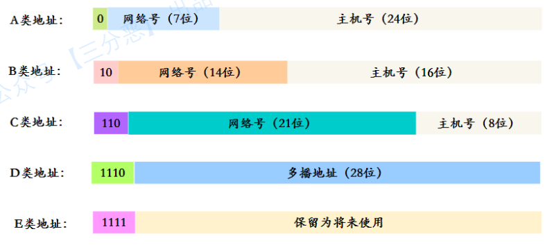

### 地址不够问题
IP地址有32位，可以标记2的32次⽅个地址，听起来很多，但是全球的⽹络设备数量已经远远超过这个数字，所以IPV4地址已经不够⽤了，那怎么解决呢？

#### DHCP
动态主机配置协议，动态分配IP地址，只给接⼊⽹络的设备分配IP地址，因此同⼀个MAC地址的设备，每次接⼊互联⽹时，得到的IP地址不⼀定是相同的，该协议使得空闲的IP地址可以得到充分利⽤。

#### CIDR
⽆类别域间路由。CIDR消除了传统的A类、B类、C类地址以及划分⼦⽹的概念，因⽽更加有效地分配IPv4的地址空间，但⽆法从根本上解决地址耗尽的问题。

#### NAT
⽹络地址转换协议，我们知道属于不同局域⽹的主机可以使⽤相同的IP地址，从⽽⼀定程度上缓解了IP资源枯竭的问题，然⽽主机在局域⽹中使⽤的IP地址是不能在公⽹中使⽤的，当局域⽹主机想要与公⽹主机进⾏通信时，NAT⽅法可以将该主机IP地址转换为全球IP地址。该协议能够有效解决IP地址不⾜的问题。

#### IPv6
作为接替IPv4的下⼀代互联⽹协议，其可以实现2的128次⽅个地址，⽽这个数量级，即使给地球上每⼀粒沙⼦都分配⼀个IP地址也够⽤，该协议能够从根本上解决IPv4地址不够⽤的问题


ARP解析流程：

1. 每台主机都会在⾃⼰的 ARP 缓冲区中建⽴⼀个 ARP 列表，以表⽰ IP 地址和 MAC地址的对应关系。
2. 当源主机需要将⼀个数据包要发送到⽬的主机时，会⾸先检查⾃⼰的 ARP 列表，是否存在该 IP 地址对应的 MAC 地址；如果有﹐就直接将数据包发送到这个 MAC 地址；如果没有，就向本地⽹段发起⼀个 ARP 请求的⼴播包，查询此⽬的主机对应的 MAC 地址。此ARP 请求的数据包⾥，包括源主机的 IP 地址、硬件地址、以及⽬的主机的 IP 地址。
3. ⽹络中所有的主机收到这个 ARP 请求后，会检查数据包中的⽬的 IP 是否和⾃⼰的 IP 地址⼀致。如果不相同，就会忽略此数据包；如果相同，该主机⾸先将发送端的 MAC 地址和 IP 地址添加到⾃⼰的 ARP 列表中，如果 ARP 表中已经存在该 IP 的信息，则将其覆盖，然后给源主机发送⼀个 ARP 响应数据包，告诉对⽅⾃⼰是它需要查找的 MAC 地址。
4. 源主机收到这个 ARP 响应数据包后，将得到的⽬的主机的 IP 地址和 MAC 地址添加到⾃⼰的 ARP 列表中，并利⽤此信息开始数据的传输。如果源主机⼀直没有收到 ARP 响应数据包，表⽰ ARP 查询失败。

##  ICMP
ICMP（Internet Control Message Protocol） ，⽹际控制报⽂协议。

* ICMP 协议是⼀种⾯向⽆连接的协议，⽤于传输出错报告控制信息。
* 主要⽤于在主机与路由器之间传递控制信息，包括 报告错误、交换受限控制和状态信息等

## TCP
### 报文格式
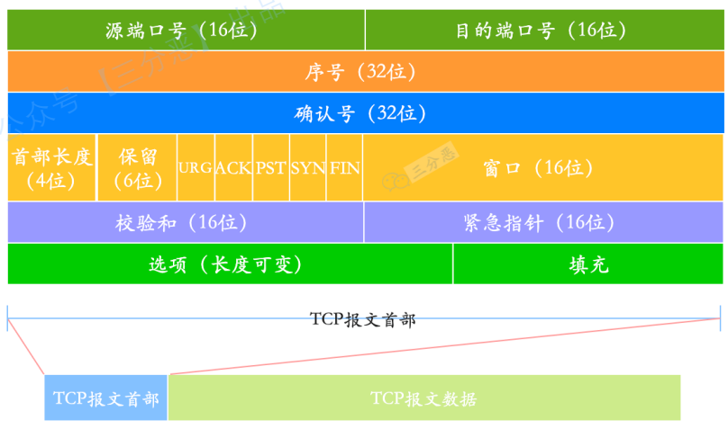

* 序号：⼀次 TCP 通信（从 TCP 连接建⽴到断开）过程中某⼀个传输⽅向上的字节流的每个字节的编号。
* 确认号 ：⽤作对另⼀⽅发送的 tcp 报⽂段的响应。其值是收到的 TCP 报⽂段的序号值加 1。
* ⾸部长度：表⽰ tcp 头部有多少个 32bit 字（4 字节）。因为 4 位最⼤能标识15，所以 TCP 头部最长是 60 字节。
* 标志位：URG(紧急指针是否有效)，ACk（表⽰确认号是否有效），PST（缓冲区尚未填满），RST（表⽰要求对⽅重新建⽴连接），SYN（建⽴连接消息标志接），FIN（表⽰告知对⽅本端要关闭连接了）
* 窗口：是 TCP 流量控制的⼀个⼿段。这⾥说的窗⼜，指的是接收通告窗⼜。它告诉对⽅本端的 TCP 接收缓冲区还能容纳多少字节的数据，这样对⽅就可以控制发送数据的速度。
* 校验和 ：由发送端填充，校验包括 TCP 头部、数据部分。

### 三次握手
TCP提供⾯向连接的服务，在传送数据前必须建⽴连接，TCP连接是通过三次握⼿建⽴的
#### 流程
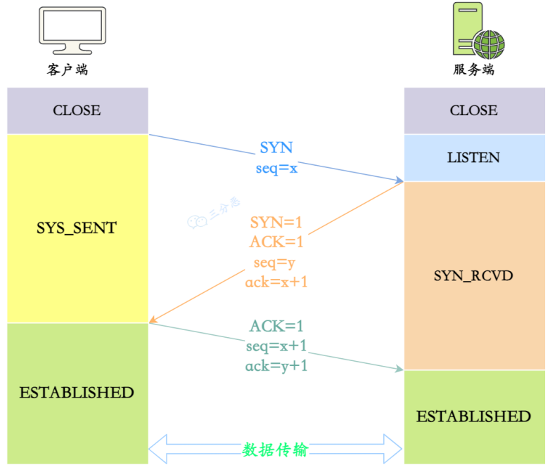

1. 客户端和服务端都处于CLOSE状态，服务端监听客户端的请求，进⼊LISTEN状态
2. 客户端端发送连接请求， 第⼀次握⼿ (SYN=1, seq=x)，发送完毕后，客户端就进⼊SYN_SENT 状态
3. 服务端确认连接， 第⼆次握⼿ (SYN=1, ACK=1, seq=y, ACKnum=x+1)， 发送完毕后，服务器端就进⼊ SYN_RCV 状态
4. 客户端收到服务端的确认之后，再次向服务端确认，这就是 第三次握⼿ (ACK=1，ACKnum=y+1)，发送完毕后，客户端进⼊ ESTABLISHED 状态，当服务器端接收到这个包时，也进⼊ESTABLISHED 状态。

* 第⼀次握⼿不能携带数据是出于安全的考虑，因为如果允许携带数据，攻击者每次在SYN报⽂中携带⼤量数据，就会导致服务端消耗更多的时间和空间去处理这些报⽂，会造成CPU和内存的消耗。
* 第3次握⼿是可以携带数据，此时客户端已经处于ESTABLISHED状态。对于客户端来说，它已经建⽴连接成功，并且确认服务端的接收和发送能⼒是正常的。
* 第⼀次握⼿服务端未收到SYN报⽂：服务端不会进⾏任何的动作，⽽客户端由于⼀段时间内没有收到服务端发来的确认报⽂，等待⼀段时间后会重新发送SYN报⽂，如果仍然没有回应，会重复这个过程，直到发送次数超过最⼤重传次数限制，就会返回连接建⽴失败。
* 第⼆次握⼿客户端未收到服务端响应的ACK报⽂：客户端会继续重传，直到次数限制；⽽服务端此时会阻塞在accept()处，等待客户端发送ACK报⽂
* 第三次握⼿服务端未收到客户端发送过来的ACK报⽂：服务端同样会采⽤类似客户端的超时重传机制，如果重试次数超过限制，则accept()调⽤返回-1，服务端建⽴连接失败；⽽此时客户端认为⾃⼰已经建⽴连接成功，因此开始向服务端发送数据，但是服务端的accept()系统调⽤已经返回，此时不在监听状态，因此服务端接收到客户端发送来的数据时会发送RST报⽂给客户端，消除客户端单⽅⾯建⽴连接的状态。

#### why三次？
* 为了防⽌服务器端开启⼀些⽆⽤的连接增加服务器开销（如：SYN Flood）
* 防⽌已失效的连接请求报⽂段突然又传送到了服务端，因⽽产⽣错误。

#### 半连接队列
三次握⼿前，服务端会从 CLOSED 状态变为 LISTEN 状态, 同时在内部创建两个队列

* 半连接队列（SYN 队列）：存放三次握⼿未完成的连接。
* 全连接队列（ACCEPT 队列）：存放完成三次握⼿的连接。

TCP 三次握⼿时，客户端发送 SYN 到服务端，服务端收到之后，便回复 ACK 和 SYN ，状态由 LISTEN 变为 SYN_RCVD ，此时这个连接就被推⼊了 SYN 队列 ，即半连接队列。

当客户端回复 ACK, 服务端接收后，三次握⼿就完成了。这时连接会等待被具体的应⽤取⾛，在被取⾛之前，它被推⼊ACCEPT队列，即全连接队列。

### 四次挥手
#### 流程
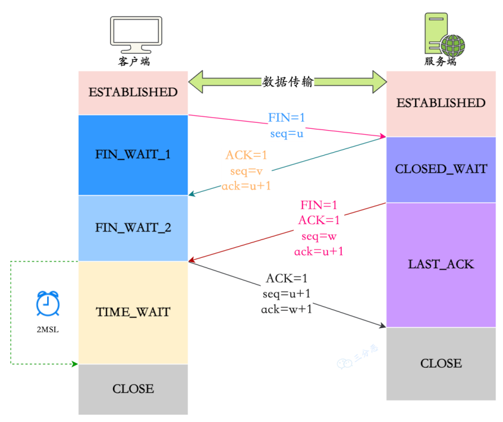

1. 数据传输结束之后，通信双⽅都可以主动发起断开连接请求，这⾥假定客户端发起
2. 客户端发送释放连接报⽂， 第⼀次挥⼿ (FIN=1，seq=u)，发送完毕后，客户端进⼊FIN_WAIT_1 状态。
3. 服务端发送确认报⽂， 第⼆次挥⼿ (ACK=1，ack=u+1,seq =v)，发送完毕后，服务器端进⼊ CLOSE_WAIT 状态，客户端接收到这个确认包之后，进⼊ FIN_WAIT_2 状态。
4. 服务端发送释放连接报⽂， 第三次挥⼿ (FIN=1，ACK1,seq=w,ack=u+1)，发送完毕后，服务器端进⼊ LAST_ACK 状态，等待来⾃客户端的最后⼀个 ACK。
5. 客户端发送确认报⽂， 第四次挥⼿ (ACK=1，seq=u+1,ack=w+1)，客户端接收到来⾃服务器端的关闭请求，发送⼀个确认包，并进⼊ TIME_WAIT 状态， 等待2MSL之后 ，没有收到服务器端的 ACK ，认为服务器端已经正常关闭连接，于是⾃⼰也关闭连接，进⼊ CLOSED 状态。
6. 服务器端接收到这个确认包之后，关闭连接，进⼊ CLOSED 状态。

#### why四次？
* 关闭连接时，客户端向服务端发送 FIN 时，仅仅表⽰客户端不再发送数据了但是还能接收数据
* 服务端收到客户端的 FIN 报⽂时，先回⼀个 ACK 应答报⽂，⽽服务端可能还有数据需要处理和发送，等服务端不再发送数据时，才发送 FIN 报⽂给客户端来表⽰同意现在关闭连接。

#### TIME_WAIT
* 为了保证客户端发送的最后⼀个 ACK 报⽂段能够到达服务端。这个 ACK 报⽂段有可能丢失，因⽽使处在 LAST-ACK 状态的服务端就收不到对已发送的 FIN + ACK 报⽂段的确认。服务端会超时重传这个 FIN+ACK 报⽂段，⽽客户端就能在 2MSL 时间内（超时 +1MSL 传输）收到这个重传的 FIN+ACK 报⽂段。接着客户端重传⼀次确认，重新启动 2MSL计时器。最后，客户端和服务器都正常进⼊到 CLOSED 状态。
* 防⽌已失效的连接请求报⽂段出现在本连接中。客户端在发送完最后⼀个 ACK 报⽂段后，再经过时间 2MSL，就可以使本连接持续的时间内所产⽣的所有报⽂段都从⽹络中消失。这样就可以使下⼀个连接中不会出现这种旧的连接请求报⽂段。

#### 2MSL
报⽂最⼤⽣存时间（ Maximum Segment Lifetime）：任何报⽂在⽹络上存在的最⻓时间，超过这个时间报⽂将被丢弃。
⽹络中可能存在来⾃发送⽅的数据包，当这些发送⽅的数据包被接收⽅处理后⼜会向对⽅发送响应，所以⼀来⼀回需要等待 2 倍的时间。⽐如如果被动关闭⽅没有收到断开连接的最后的 ACK 报⽂，就会触发超时重发 Fin 报⽂，另⼀⽅接收到 FIN 后，会重发 ACK 给被动关闭⽅， ⼀来⼀去正好 2 个 MSL。

### 流量控制
以让发送端根据接收端的实际接收能⼒控制发送的数据量。

#### 滑动窗口
TCP 发送⼀个数据，如果需要收到确认应答，才会发送下⼀个数据。这样效率会⽐较低。
滑动窗口：操作系统开辟的⼀个缓存空间。窗⼜⼤⼩值表⽰⽆需等待确认应答，⽽可以继续发送数据的最⼤值。

TCP 头部有个字段叫 win，也即那个 16 位的窗⼜⼤⼩，它告诉对⽅本端的 TCP 接收缓冲区还能容纳多少字节的数据，这样对⽅就可以控制发送数据的速度，从⽽达到流量控制的⽬的。
##### 发送窗口
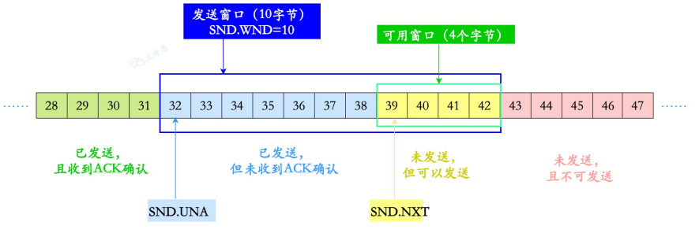

* 深蓝⾊框⾥就是发送窗口。
* SND.WND: 表⽰发送窗⼜的⼤⼩, 上图虚线框的格⼦数是 10个，即发送窗⼜⼤⼩是 10。
* SND.NXT：下⼀个发送的位置，它指向未发送但可以发送的第⼀个字节的序列号。
* SND.UNA: ⼀个绝对指针，它指向的是已发送但未确认的第⼀个字节的序列号。

##### 接收窗口
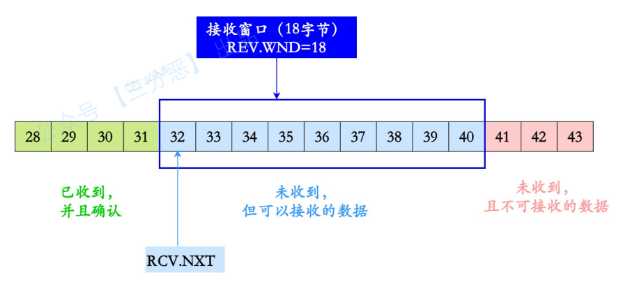

* 蓝⾊框内，就是接收窗⼜。
* REV.WND: 表⽰接收窗⼜的⼤⼩, 上图虚线框的格⼦就是 9 个。
* REV.NXT: 下⼀个接收的位置，它指向未收到但可以接收的第⼀个字节的序列号。

### 拥塞控制
流量控制是避免发送⽅的数据填满接收⽅的缓存，但是并不知道整个⽹络之中发⽣了什么。
拥塞控制的⽬的就是避免发送⽅的数据填满整个⽹络。

#### 拥塞窗口
拥塞窗口 cwnd（congestion window）：发送⽅维护的⼀个的状态变量，根据⽹络的拥塞程度动态变化，调节所要发送数据的量。

发送窗⼜的值是swnd = min(cwnd, rwnd)，也就是拥塞窗⼜和接收窗⼜中的最⼩值。

拥塞窗⼜ cwnd 变化的规则：
* 只要⽹络中没有出现拥塞， cwnd 就会增⼤。
* 但⽹络中出现了拥塞， cwnd 就减少。
#### 慢启动
TCP 建⽴连接完成后，⼀开始不要发送⼤量的数据，⽽是先探测⼀下⽹络的拥塞程度。由⼩到⼤逐渐增加拥塞窗⼜的⼤⼩，如果没有出现丢包，每收到⼀个 ACK，就将拥cwnd的⼤⼩加 1（单位是 MSS）。每轮次发送窗⼜增加⼀倍，呈指数增长，如果出现丢包，拥塞窗⼜就减半，进⼊拥塞避免阶段。

为了防⽌ cwnd 增长过⼤引起⽹络拥塞，还需设置⼀个慢启动阀值 ssthresh（slow start threshold）状态变量。当 cwnd 到达该阀值后，就好像⽔管被关⼩了⽔龙头⼀样，减少拥塞状
态。即当 cwnd >ssthresh 时，进⼊了拥塞避免算法。

#### 拥塞避免
⼀般来说，慢启动阀值 ssthresh 是 65535 字节， cwnd 到达慢启动阀值后：
* 每收到⼀个 ACK 时，cwnd = cwnd + 1/cwnd
* 当每过⼀个 RTT 时，cwnd = cwnd + 1

这是⼀个线性上升的算法，避免过快导致⽹络拥塞问题

#### 拥塞发生
当⽹络拥塞发⽣丢包时，会有两种情况：

* RTO 超时重传
* 快速重传

##### RTO
如果是发⽣了 RTO 超时重传，就会使⽤拥塞发⽣算法：

* 慢启动阀值 sshthresh = cwnd /2
* cwnd 重置为 1
* 进⼊新的慢启动过程
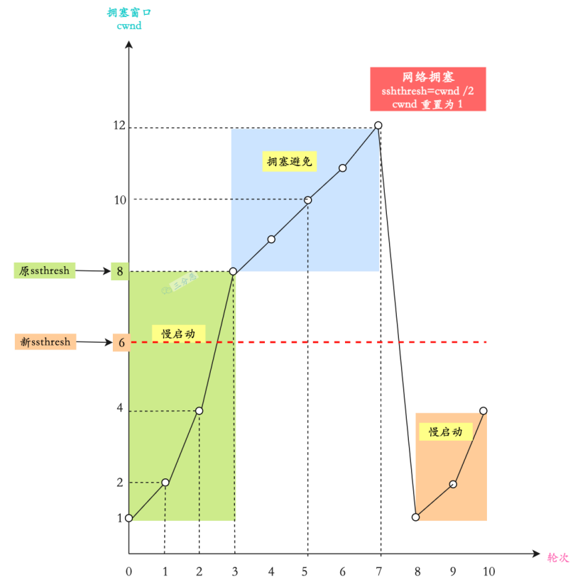

##### 快速重传、恢复
发送⽅收到 3 个连续重复的 ACK 时，就会快速地重传，不必等待 RTO 超时再重传。
发⽣快速重传的拥塞发⽣算法：

* 拥塞窗⼜⼤⼩ cwnd = cwnd/2
* 慢启动阀值 ssthresh = cwnd
* 进⼊快速恢复算法

快速恢复算法：

* cwnd = sshthresh + 3
* 重传重复的那⼏个 ACK（即丢失的那⼏个数据包）
* 如果再收到重复的 ACK，那么 cwnd = cwnd +1
* 如果收到新数据的 ACK 后, cwnd = sshthresh。因为收到新数据的 ACK，表明恢复过程已
经结束，可以再次进⼊了拥塞避免的算法了。
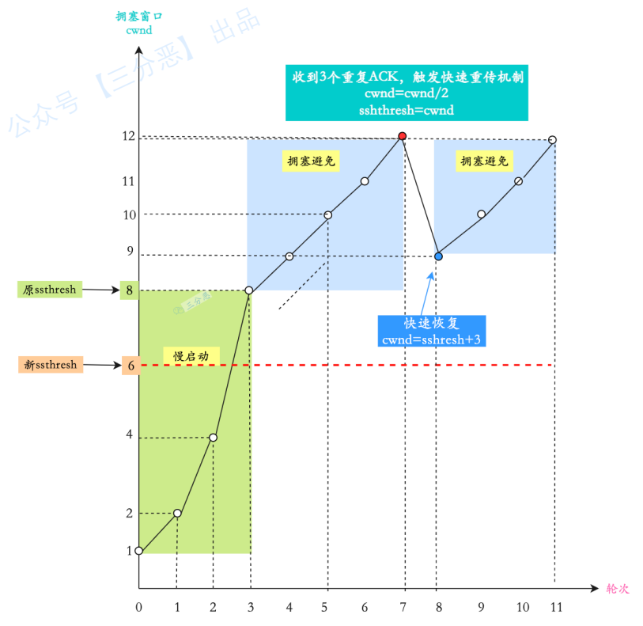

### 重传机制

#### 超时重传
超时重传，是 TCP 协议保证数据可靠性的另⼀个重要机制，其原理是在发送某⼀个数据以后就开启⼀个计时器，在⼀定时间内如果没有得到发送的数据报的 ACK 报⽂，那么就重新发送数据，直到发送成功为⽌。

RTT（Round-Trip Time，往返时间）：是数据完全发送完，到收到确认信号的时间，即数据包的⼀次往返时间。

RTO（Retransmission Timeout，超时重传时间)：⼀般来说，RTO 略微⼤于 RTT，效果是最佳的。

缺点：

* 增加了端到端的时延
* 引起不必要的重传（等待超时过程中后续报文得不到确认）

#### 快速重传
快速重传（Fast Retransmit）机制，不以时间为驱动，⽽是以数据驱动重传，基于接收端的反馈信息来引发重传的。

快速重传机制只解决了⼀个问题，就是超时时间的问题；但是它依然⾯临着另外⼀个问题。就是重传的时候，是重传之前的⼀个，还是重传所有的问题。

#### 带选择确认的重传（SACK）
为了解决应该重传多少个包的问题? TCP 提供了带选择确认的重传（即 SACK，Selective Acknowledgment）。

在快速重传的基础上，接收⽅返回最近收到报⽂段的序列号范围，这样发送⽅就知道接收⽅哪些数据包是没收到的。这样就很清楚应该重传哪些数据包。

#### 重复 SACK
D-SACK，英⽂是 Duplicate SACK，是在 SACK 的基础上做了⼀些扩展，主要⽤来告诉发送
⽅，有哪些数据包，⾃⼰重复接受了。

DSACK 的⽬的是帮助发送⽅判断，是否发⽣了包失序、ACK 丢失、包重复或伪重传。让
TCP 可以更好的做⽹络流控。

### 粘包、拆包
TCP 是⾯向流，没有界限的⼀串数据。TCP 底层并不了解上层业务数据的具体含义，它会根据 TCP 缓冲区的实际情况进⾏包的划分，所以在业务上认为，⼀个完整的包可能会被 TCP拆分成多个包进⾏发送，也有可能把多个⼩的包封装成⼀个⼤的数据包发送，这就是所谓的TCP 粘包和拆包问题。

为什么会产⽣粘包和拆包呢?

* 要发送的数据⼩于TCP发送缓冲区的⼤⼩，TCP将多次写⼊缓冲区的数据⼀次发送出去，将会发⽣粘包；
* 接收数据端的应⽤层没有及时读取接收缓冲区中的数据，将发⽣粘包；
* 要发送的数据⼤于 TCP 发送缓冲区剩余空间⼤⼩，将会发⽣拆包；
* 待发送数据⼤于 MSS（最⼤报⽂长度），TCP 在传输前将进⾏拆包。即 TCP 报⽂长度 -
TCP 头部长度 > MSS。

解决：

* 发送端将每个数据包封装为固定长度
* 在数据尾部增加特殊字符进⾏分割
* 将数据分为两部分，⼀部分是头部，⼀部分是内容体；其中头部结构⼤⼩固定，且有⼀个字段声明内容体的⼤⼩。

### Nagle 算法
任意时刻，最多只能有⼀个未被确认的⼩段。所谓 “⼩段”，指的是⼩于 MSS 尺⼨的数据块，所谓 “未被确认”，是指⼀个数据块发送出去后，没有收到对⽅发送的 ACK 确认该数据已收到。

Nagle 算法的策略：

* 没有已发送未确认报⽂时，⽴刻发送数据。
* 存在未确认报⽂时，直到没有已发送未确认报⽂或数据⻓度达到 MSS ⼤⼩时，再发送数据。

只要没满⾜上⾯条件中的⼀条，发送⽅⼀直在囤积数据，直到满⾜上⾯的发送条件。

### 延迟确认
当没有携带数据的ACK，⽹络效率很低，为了解决 ACK 传输效率低问题，所以就衍⽣出了 TCP 延迟确认。

TCP 延迟确认的策略：

* 当有响应数据要发送时，ACK 会随着响应数据⼀起⽴刻发送给对⽅。
* 当没有响应数据要发送时，ACK 将会延迟⼀段时间，以等待是否有响应数据可以⼀起发送
* 如果在延迟等待发送 ACK 期间，对⽅的第⼆个数据报⽂⼜到达了，这时就会⽴刻发送
ACK。

⼀般情况下，Nagle 算法和延迟确认不能⼀起使⽤，Nagle 算法意味着延迟发，延迟确认意味
着延迟接收，两个凑在⼀起就会造成更⼤的延迟，会产⽣性能问题。

### 可靠性保障
* 连接管理：TCP使⽤三次握⼿和四次挥⼿保证可靠地建⽴连接和释放连接
* 校验和：TCP 将保持它⾸部和数据的检验和。这是⼀个端到端的检验和，⽬的是检测数据在传输过程中的任何变化。如果接收端的检验和有差错，TCP 将丢弃这个报⽂段和不确认收到此报⽂段。
* 序列号/确认应答：TCP 给发送的每⼀个包进⾏编号，接收⽅会对收到的包进⾏应答，发送⽅就会知道接收⽅是否收到对应的包，如果发现没有收到，就会重发，这样就能保证数据的完整性。
* 流量控制：TCP 连接的每⼀⽅都有固定⼤⼩的缓冲空间，TCP的接收端只允许发送端发送接收端缓冲区能接纳的数据。当接收⽅来不及处理发送⽅的数据，能提⽰发送⽅降低发送的速率，防⽌包丢失。TCP 使⽤的流量控制协议是可变⼤⼩的滑动窗⼜协议。 
* 最⼤消息长度：在建⽴TCP连接的时候，双⽅约定⼀个最⼤的长度（MSS）作为发送的单位，重传的时候也是以这个单位来进⾏重传。理想的情况下是该长度的数据刚好不被⽹络层分块。
* 超时重传：超时重传是指发送出去的数据包到接收到确认包之间的时间，如果超过了这个时间会被认为是丢包了，需要重传。
* 拥塞控制：如果⽹络⾮常拥堵，此时再发送数据就会加重⽹络负担，那么发送的数据段很可能超过了最⼤⽣存时间也没有到达接收⽅，就会产⽣丢包问题。为此TCP引⼊慢启动机制，先发出少量数据，就像探路⼀样，先摸清当前的⽹络拥堵状态后，再决定按照多⼤的速度传送数据。
* 
### 保活计时器
服务器每收到⼀次客户端的数据，就重新设置保活计时器，时间的设置通常是两个⼩时。若两个⼩时都没有收到客户端的数据，服务端就发送⼀个探测报⽂段，以后则每隔 75 秒钟发送⼀次。若连续发送 10 个探测报⽂段后仍然⽆客户端的响应，服务端就认为客户端出了故障，接着就关闭这个连接。

## UDP
TCP 是⾯向连接，⽽ UDP 是⽆连接。
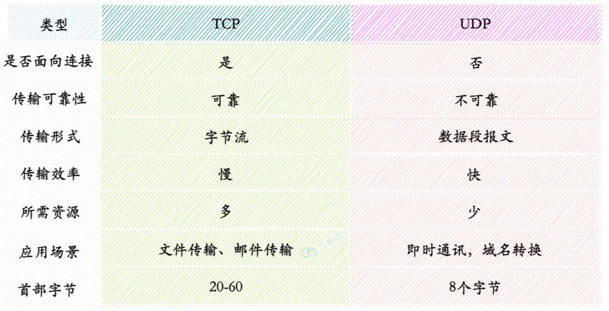

* TCP应⽤场景： 效率要求相对低，但对准确性要求相对⾼的场景。
* UDP应⽤场景： 效率要求相对⾼，对准确性要求相对低的场景。

### 不可靠

UDP在传输数据之前不需要先建⽴连接，远地主机的运输层在接收到UDP报⽂后，不需要确认，提供不可靠交付。总结就以下四点：

* 不保证消息交付：不确认，不重传，⽆超时
* 不保证交付顺序：不设置包序号，不重排，不会发⽣队⾸阻塞
* 不跟踪连接状态：不必建⽴连接或重启状态机
* 不进⾏拥塞控制：不内置客户端或⽹络反馈机制


## DNS
域名解析系统（domain name system）。功能是域名和IP的相互映射。具体过程如下：
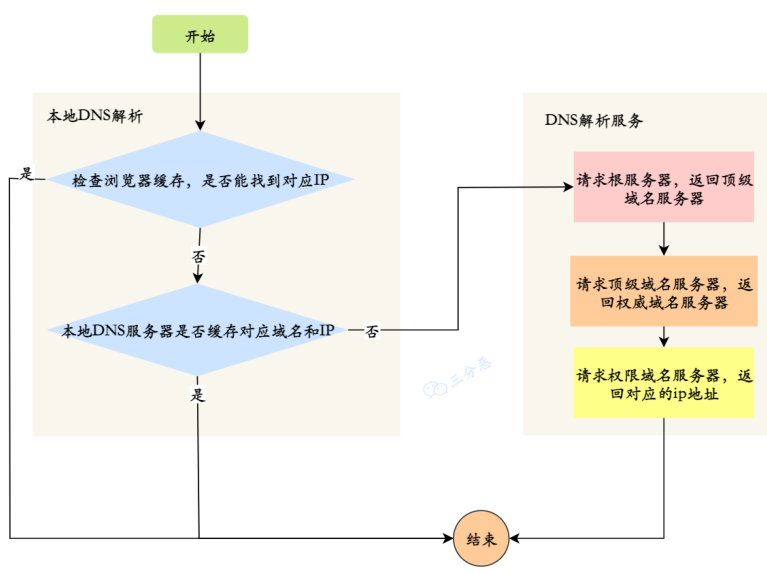
顶级域名服务器：org、com、edu等
权威域名服务器：baidu.com

## HTTP
超⽂本传输协议
无状态，可通过cookie、session保存状态
### 请求方式

#### GET
将请求将信息放在URL中，对服务器资源的简单请求。
* GET 请求携带的数据量有限，因为 URL 本⾝是有长度限制的
* 请求把数据放URL上不太安全
* 从数据库层⾯来看，GET 符合幂等性和安全性（只查不改）

#### POST
将请求信息放在请求体中，向服务器提交数据请求

* 对⼤⼩没有限制
* 把数据放在请求体⾥想⽐较⽽⾔安全


#### PUT
向服务端提交数据，以修改数据

#### DELETE
删除资源

#### CONNECT
用于ssl隧道的基于代理的请求

#### TRANCE
追踪请求-响应的传输路径

#### OPTIONS
返回所有可用方法，常用于跨域

#### HEAD
获取URL标记的资源的首部

### 报文结构
#### 请求
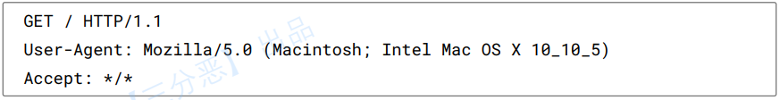

第一行叫做请求行，包含三个字段：

* ⽅法字段：包括POST、GET等请⽅法。
* URL 字段
* HTTP 版本字段。

后⾯的⾏叫做⾸部⾏，⾸部⾏后还可以跟⼀个实体主体。请求⾸部之后有⼀个空⾏，这个空⾏不能省略，它⽤来划分⾸部与实体

#### 响应
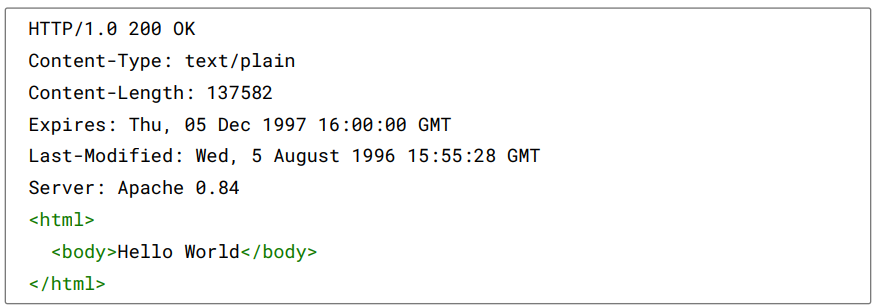
第⼀⾏叫做状态⾏，包含了三个字段：协议版本字段、状态码和相应的状态信息
后⾯的⾏是⾸部⾏，其中通⽤⾸部和实体⾸部在请求报⽂和响应报⽂中都可以设置，区别在于请求⾸部和响应⾸部：

* 请求⾸部：Accept 可接收媒体资源的类型、Accept-Charset 可接收的字符集、Host 请求的主机名等
* 响应⾸部：ETag 资源的匹配信息，Location 客户端重定向的 URI等
* 通⽤⾸部：Cache-Control 控制缓存策略、Connection 管理持久连接等
* 实体⾸部：Content-Length实体主体的⼤⼩、Expires实体主体的过期时间、Last-Modified资源的最后修改时间

### 长连接
HTTP 分为长连接和短连接， 本质上说的是 TCP 的长短连接，TCP 长连接可以复⽤⼀个 TCP 连接，来发起多次的 HTTP 请求，这样就可以减少资源消耗。

通过在头部（请求和响应头）设置 Connection 字段指定为 keep-alive ，HTTP/1.0 协议⽀持，但是是默认关闭的，从 HTTP/1.1 以后，连接默认都是长连接。

内核keepalive配置：
```shell
$tcp_keepalive_intvl = 15
$tcp_keepalive_probes = 5
$tcp_keepalive_time = 1800
```
当TCP连接闲置时间超过tcp_keepalive_time，则开始侦测，如未收到侦测包，则周期（tcp_keepalive_intvl）性地发送侦测包，直到探测包数量达到tcp_keepalive_probes，则丢弃连接。

### Cookie
Cookie 是保存在客户端的⼀⼩块⽂本串的数据。客户端向服务器发起请求时，服务端会向客户端发送⼀个 Cookie，客户端就把 Cookie 保存起来。在客户端下次向同⼀服务器再发起请求时，Cookie 被携带发送到服务器。服务端可以根据这个Cookie判断⽤户的⾝份和状态。

* 保存在客户端
* 只能保存ASCII类型的数据
* Cookie 可设置为长时间保持，⽐如我们经常使⽤的默认登录功能
* Cookie 存储在客户端，⽐较容易遭到不法获取
* 单个Cookie保存的数据不能超过4K

### Session
Session 指的就是服务器和客户端⼀次会话的过程。它是另⼀种记录客户状态的机制。不
同的是cookie保存在客户端浏览器中，⽽session保存在服务器上。客户端浏览器访问服务
器的时候，服务器把客户端信息以某种形式记录在服务器上，这就是session。客户端浏览
器再次访问时只需要从该session中查找⽤户的状态。

* 保存在服务器端
* 可以存任意类型的数据
* Session⼀般有效时间较短，客户端关闭或者 Session 超时都会失效。
* Session 存储在服务端，安全性相对 Cookie要好⼀些
* Session可存储数据远⾼于 Cookie

### 状态码
* 1XX：信息性状态码
* 2XX：成功状态码
* 3XX：重定向状态码
* 4XX：客户端错误状态码
* 5XX：服务端错误状态码

常用状态码：
| 状态码    |    含义 |
| :-: | :-: |
|  100   |    初始的请求已经接受，请客户端继续发送剩余部分 |
|  101   |    切换请求协议 |
|  200   |   请求成功  |
|   301  |   请求资源永久移动，返回新URI  |
|   302  |     请求资源临时移动，继续使用原有URI|
|   304  |     自从上次请求后，请求的网页未修改过|
| 400    |  客户端请求的语法错误，服务端无法理解   |
|  401   |   当前请求需要认证  |
|  403   |   服务端理解请求，但是拒绝执行，权限问题  |
|  404   |   服务器找不到请求的页面  |
|  500   |   服务器内部错误  |

* 301：永久性移动，请求的资源已被永久移动到新位置。服务器返回此响应时，会返回新
的资源地址。
* 302：临时性性移动，服务器从另外的地址响应资源，但是客户端还应该使⽤这个地址

### 版本对比
HTTP/1.0 默认是短连接，可以强制开启，HTTP/1.1 默认长连接，HTTP/2.0 采⽤多路复⽤

#### HTTP/1.0
默认使⽤ 短连接 ，每次请求都需要建⽴⼀个 TCP 连接。它可以设置 Connection:keep-alive 这个字段，强制开启长连接。

#### HTTP/1.1
* 引⼊了持久连接，即 TCP 连接默认不关闭，可以被多个请求复⽤
* 分块传输编码，即服务端每产⽣⼀块数据，就发送⼀块，⽤” 流模式” 取代” 缓存模式”。
* 管道机制，即在同⼀个 TCP 连接⾥⾯，客户端可以同时发送多个请求。

#### HTTP/2.0
* ⼆进制协议，1.1 版本的头信息是⽂本（ASCII 编码），数据体可以是⽂本或者⼆进制；2.0 中，头信息和数据体都是⼆进制。
* 完全多路复⽤，在⼀个连接⾥，客户端和浏览器都可以同时发送多个请求或回应，⽽且不⽤按照顺序⼀⼀对应。
* 报头压缩，HTTP 协议不带有状态，每次请求都必须附上所有信息。Http/2.0 引⼊了头信息压缩机制，使⽤ gzip 或 compress 压缩后再发送。
* 服务端推送，允许服务器未经请求，主动向客户端发送资源

#### HTTP/3
HTTP/3主要有两⼤变化，传输层基于UDP、使⽤QUIC保证UDP可靠性

* 使⽤UDP作为传输层进⾏通信
* 在UDP的基础上QUIC协议保证了HTTP/3的安全性，在传输的过程中就完成了TLS加密握⼿。
* HTTPS 要建⽴⼀个连接，要花费 6 次交互，先是建⽴三次握⼿，然后是 TLS/1.3 的三次握⼿。QUIC 直接把以往的 TCP 和 TLS/1.3 的 6 次交互合并成了 3 次，减少了交互次数。
* QUIC 有⾃⼰的⼀套机制可以保证传输的可靠性的。当某个流发⽣丢包时，只会阻塞这个
流，其他流不会受到影响

## HTTPS
因为HTTP 是明⽂传输，存在安全上的风险：窃听风险、篡改风险、冒充风险。引⼊HTTPS，在 HTTP 与 TCP 层之间加⼊了 SSL/TLS 协议，可以很好的解决这些风险：

* 在TCP 和 HTTP ⽹络层之间加⼊了 SSL/TLS 安全协议，使得报⽂能够加密传输。
* 在TCP 三次握⼿之后，还需进⾏ SSL/TLS 的握⼿过程，才可进⼊加密报⽂传输。
* 端口号：443。
* 需要向 CA（Certificate Authority，证书权威机构）申请数字证书，来保证服务器的⾝份是可信的。

### 工作流程
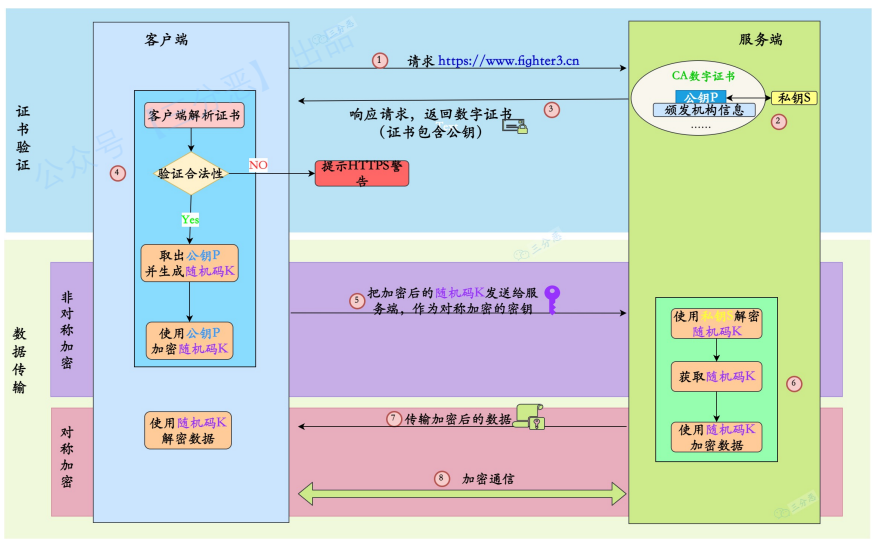

1. 客户端发起 HTTPS 请求，连接到服务端的 443 端口。
2. 服务端有⼀套数字证书（证书内容有公钥、证书颁发机构、失效⽇期等）。
3. 服务端将⾃⼰的数字证书发送给客户端（公钥在证书⾥⾯，私钥由服务器持有）。
4. 客户端收到数字证书之后，会验证证书的合法性。如果证书验证通过，就会⽣成⼀个随机的对称密钥，⽤证书的公钥加密。
5. 客户端将公钥加密后的密钥发送到服务器。
6. 服务器接收到客户端发来的密⽂密钥之后，⽤⾃⼰之前保留的私钥对其进⾏⾮对称解密，解密之后就得到客户端的密钥，然后⽤客户端密钥对返回数据进⾏对称加密，酱紫传输的数据都是密⽂啦。
7. 服务器将加密后的密⽂返回到客户端。
8. 客户端收到后，⽤⾃⼰的密钥对其进⾏对称解密，得到服务器返回的数据。


## QUIC

## 加密
* 对称加密：加密和解密使⽤同⼀密钥
* ⾮对称加密：加密和解密使⽤不同的密钥（即公钥和私钥）

### 对称加密
运算速度较快，缺点是如何安全将密钥传输给另⼀⽅。常见的对称加密算法有：DES、AES 等。

#### AES
秘钥长度最长只有256个⽐特，加密和解密速度较快，易于硬件实现。由于是对称加密，通信双⽅在进⾏数据传输前需要获知加密密钥。

### 非对称加密
公钥与私钥成对存在，如果⽤公钥对数据进⾏加密，只有对应的私钥才能解密。
#### RSA
采⽤公钥进⾏加密，私钥解密的形式。其私钥长度⼀般较长，由于需要⼤数的乘幂求模等运算，其运算速度较慢，不合适⼤量数据⽂件加密。

快速UDP⽹络连接(Quick UDP Connections)
## 网络综合
### 浏览器输入URL
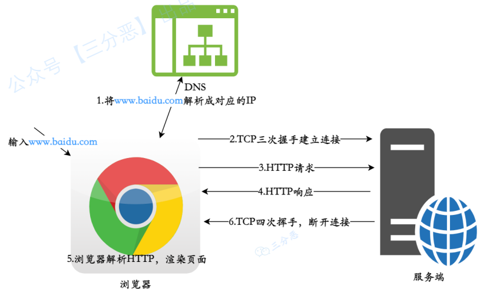

1. 浏览器查找域名对应的后端IP地址，DNS查找过程：浏览器缓存、本地DNS路由缓存、DNS解析服务器

## 网络攻击
* 被动攻击：是指攻击者从⽹络上窃听他⼈的通信内容，通常把这类攻击称为截获，被动攻击主要有两种形式：消息内容泄露攻击和流量分析攻击。由于攻击者没有修改数据，使得这种攻击很难被检测到。
* 主动攻击：直接对现有的数据和服务造成影响，常见的主动攻击类型有：
    * 篡改 ：攻击者故意篡改⽹络上送的报⽂，甚⾄把完全伪造的报⽂传送给接收⽅。    
    * 恶意程序 ：恶意程序种类繁多，包括计算机病毒、计算机蠕⾍、特洛伊⽊马、后门⼊侵、流氓软件等等。
    * 拒绝服务Dos ：攻击者向服务器不停地发送分组，使服务器⽆法提供正常服务。


### Dos
 (Denial of Service), 翻译过来就是拒绝服务, ⼀切能引起拒绝⾏为的攻击都被称为DOS 攻击。最常见的 DoS 攻击就有计算机⽹络宽带攻击、连通性攻击。
 


### DDos
DDos（Distributed Denial of Service，分布式拒绝服务攻击）：分布式拒绝服务攻击是指处于不同位置的多个攻击者同时向一个或数个目标发动攻击，或者一个攻击者控制了位于不同位置的多台机器并利用这些机器对受害者同时实施攻击。由于攻击的发出点是分布在不同地方的，这类攻击称为分布式拒绝服务攻击，其中的攻击者可以有多个。

主要形式有流量攻击和资源耗尽攻击，常见的 DDoS攻击有： SYN Flood、Ping of Death、ACK Flood、UDP Flood 等。

#### SYN Flood
它在短时间内，伪造不存在的 IP 地址, 向服务器发送⼤量SYN 报⽂。当服务器回复 SYN+ACK 报⽂后，不会收到 ACK 回应报⽂，那么SYN队列⾥的连接旧不会出对队，久⽽久之就会占满服务端的 SYN 接收队列（半连接队列），使得服务器不能为正常⽤户服务。
##### 解决办法
syn cookie ：在收到 SYN 包后，服务器根据⼀定的⽅法，以数据包的源地址、端⼜等信息为参数计算出⼀个 cookie 值作为⾃⼰的 SYNACK 包的序列号，回复 SYN+ACK 后，服务器并不⽴即分配资源进⾏处理，等收到发送⽅的 ACK 包后，重新根据数据包的源地址、端⼜计算该包中的确认序列号是否正确，如果正确则建⽴连接，否则丢弃该包。

SYN Proxy 防⽕墙 ：服务器防⽕墙会对收到的每⼀个 SYN 报⽂进⾏代理和回应，并保持
半连接。等发送⽅将 ACK 包返回后，再重新构造 SYN 包发到服务器，建⽴真正的 TCP
连接。

### DRDoS
 (Distributed Reflection Denial of Service)，中⽂是分布式反射拒绝服务，该⽅式靠的是发送⼤量带有被害者 IP 地址的数据包给攻击主机，然后攻击主机对 IP 地址源做出⼤量回应，从⽽形成拒绝服务攻击。

### XSS
跨站脚本攻击（Cross-Site Scripting），恶意攻击者往 Web 页⾯⾥插⼊恶意 html 代码，当⽤户浏览⽹页的时候，嵌⼊其中 Web ⾥⾯的 html 代码会被执⾏，从⽽达到恶意攻击⽤户的特殊⽬的。

解决办法：

* 对输⼊进⾏过滤，过滤标签等，只允许合法值。
* 限制输⼊长度
* 对于链接跳转，如 <a href="xxx" 等，要校验内容，禁⽌以 script 开头的⾮法链接。

## 杂项
### 端口
常见服务对应端口如下：
| 端口  |         服务          |
| :--: | :-------------------: |
|  21  |  FTP（文件传输协议）   |
|  22  |          SSH          |
|  23  | Telnet（远程登录服务） |
|  25  | SMTP（简单邮件传输协议） |
|  53  |  DNS（域名解析服务）   |
|  80  |  HTTP(超文本传输协议)  |
| 443  |         HTTPS         |
| 1080 |        Sockets        |
| 3306 |    MySQL默认端口号     |

### URI和URL
URI，统⼀资源标识符(Uniform Resource Identifier，URI)，标识的是Web上每⼀种可⽤的
资源，如 HTML⽂档、图像、视频⽚段、程序等都是由⼀个URI进⾏标识的。
URL，统⼀资源定位符（Uniform Resource Location)，它是URI的⼀种⼦集，主要作⽤是
提供资源的路径。

主要区别在于URL除了提供了资源的标识，还提供了资源访问的⽅式

### socket
Socket 是⼀套标准，它完成了对 TCP/IP 的⾼度封装，屏蔽⽹络细节，以⽅便开发者更好地进⾏⽹络编程。
Socket 其实就是等于IP地址 + 端口 + 协议
Socket ⼀个是 ⽹编编程的标准接⼜ 
### WebSocket
WebSocket 是⼀个持久化的协议，它是伴随应用层⽽出的协议，⽤来解决http不⽀持持久化
连接 的问题
WebSocket 则是应⽤层通信协议