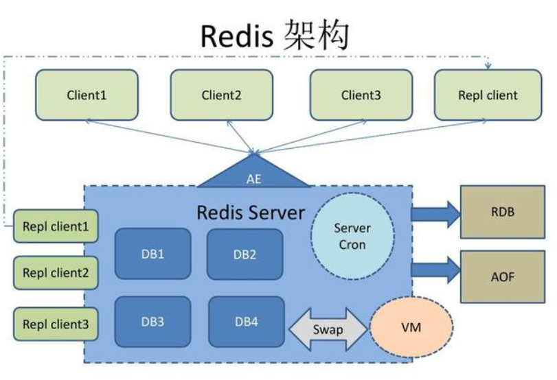

# redis
## 简介
Redis是一个开源的、使用C语言编写的、高性能(读：110000次/s，写：81000次/s)、可基于内存也可持久化的K-V型的NoSQL数据库


## 安装
```
* # 更新一下源
apt-get update

# 安装redis
apt-get install redis-server

# 重启redis
redis-server

# 设置密码
vim /etc/redis/redis.conf #取消注释requirepass

# 配置Redis远程访问
vim /etc/redis/redis.conf #注释bind
# bind 127.0.0.1

# 重启
sudo service redis-server restart
```
## 单线程实现
利用队列技术将并发访问变为串行访问，消除了传统数据库串行控制的开销

1. 基于内存实现，访问速度快，CPU不是瓶颈（瓶颈来源于机器内存或网络带宽）
2. 利用hashMap存储数据，牺牲存储空间，换来O（1）的查找、操作时间复杂度
3. 更好的可维护性，方便开发和调试
* 避免了不必要的上下文切换、竞争条件、锁等
* 多路I/O复用模型，非阻塞IO；这里“多路”指的是多个网络连接，“复用”指的是复用同一个线程
* 自己构建了VM 机制

## 淘汰策略
volatile-lru：从已设置过期时间的数据集中挑选最近最少使用的数据淘汰

volatile-ttl：从已设置过期时间的数据集中挑选将要过期的数据淘汰

volatile-random：从已设置过期时间的数据集中任意选择数据淘汰

allkeys-lru：从所有数据集中挑选最近最少使用的数据淘汰

allkeys-random：从所有数据集中任意选择数据进行淘汰

noeviction：禁止驱逐数据 需要先设置最大内存maxmemory，然后如果内存不足，会触发我们选择的过期淘汰策略
## 持久化
持久化保证即使redis服务重启也不会丢失数据（硬盘恢复）
### RDB
按照一定的时间将内存的数据以快照的形式保存到硬盘中，对应产生的数据文件为dump.rdb；如果系统发生故障，将会丢失最后一次创建快照之后的数据


* 默认开启
* RDB写入，每次都是全量，在数据量特别大时，服务器负载会比较高
* RDB会在服务器宕机时，丢失几分钟的数据，主要是根据save策略来的

### AOF
重写


* 默认关闭
* 重写是直接把当前内存的数据生成对应命令，不需要分析老的AOF文件；
* 恢复数据时，会先判断有没有AOF，没有的话，在加载RDB，因为AOF文件相对完整；

## 部署
### 主从
从服务器连接主服务器，发送SYNC命令；

主服务器接收到SYNC命名后，开始执行BGSAVE命令生成RDB文件并使用缓冲区记录此后执行的所有写命令；

主服务器BGSAVE执行完后，向所有从服务器发送快照文件，并在发送期间继续记录被执行的写命令；

从服务器收到快照文件后丢弃所有旧数据，载入收到的快照；

主服务器快照发送完毕后开始向从服务器发送缓冲区中的写命令；

从服务器完成对快照的载入，开始接受命令请求，并执行来自主服务器缓冲区的写命令；（从服务器初始化完成）

主服务器每执行一个写命令就会向从服务器发送相同的写命令，从服务器接收并执行收到的写命令（从服务器初始化完成后的操作）

一般主从配置可以缓解请求压力，做读写分离，写服务器不开启持久化，从服务器开启，从服务器还负责读取的操作，而且从服务器可以是多个，可以有效缓解主服务器的压力；但是坏处在于，如果主服务器宕机，无法自动切换恢

### 哨兵
作用：

* 监控主服务器和从服务器是否正常运行

* 主服务器出现故障时自动将从服务器转换为主服务器

* 也具备了主从的全部好处

哨兵其实是对主从配置的补充，可以自动选举出新的主，提供服务，但是，如果单机redis数据量过大，这个部署就无法处理了，需要cluster模式进行分片

工作方式：

### 集群
* 多个redis节点网络互联，数据共享

* 所有的节点都是一主一从（也可以是一主多从），其中从不提供服务，仅作为备用

* 不支持同时处理多个key（如MSET/MGET）

* 支持在线增加、删除节点

## 优势
* 性能极高
* 丰富的数据类型： Strings, Lists, Hashes, Sets 、Ordered Set
* . 原子 – Redis的所有操作都是原子性的，同时Redis还支持对几个操作全并后的原子性执行
* 丰富的特性 – Redis还支持 publish/subscribe, 通知, key 过期等等特性

### 对比k-v存储
* 更为复杂的数据结构并且提供对他们的原子性操作
* 数据类型都是基于基本数据结构的同时对程序员透明，无需进行额外的抽象
* 运行在内存中但是可以持久化到磁盘
## 使用场景
### 持久化信息的缓存
利用其极好的读性能，将持久化数据一次性加载到redis，提供高性能的读取服务

## 常见问题

### 数据一致性
缓存与强一致性不可共存，只能通过适当策略降低不一致的概率，而无法保证强一致性
合适的策略包括 合适的缓存更新策略，更新数据库后要及时更新缓存、缓存失败时增加重试机制，例如MQ模式的消息队列


### 缓存雪崩
缓存雪崩：由于访问的数据不在缓存中，或者key同时过期，导致大量请求到达数据库
解决：

1. 用加锁或者队列的方式保证来保证不会有大量的线程对数据库一次性进行读写
2. 读写分离，业务代码负责读，定时脚本负责写
3. 备份缓存，缓存A和缓存B，A设置超时时间，B不设值超时时间，先从A读缓存，A没有读B，并且更新A缓存和B缓存
4. 原有的失效时间基础上增加一个随机值
### 缓存击穿
缓存击穿：单个key的高并发访问，高负载导致命中丢失，大量并发到达数据库
解决：
对缓存查询加锁，如果KEY不存在，就加锁，然后查DB入缓存，然后解锁；其他进程如果发现有锁就等待，然后等解锁后返回数据或者进入DB查询

### 穿透
查询一个一定不存在的数据，由于缓存是不命中时被动写的，并且出于容错考虑，如果从存储层查不到数据则不写入缓存，这将导致这个不存在的数据每次请求都要到存储层去查询，失去了缓存的意义

解决：如果一个查询返回的数据为空，我们仍然把这个空结果进行缓存，但它的过期时间会很短，最长不超过五分钟

### 缓存并发
这里的并发指的是多个redis的client同时set key引起的并发问题。比较有效的解决方案就是把redis.set操作放在队列中使其串行化，必须的一个一个执行，具体的代码就不上了，当然加锁也是可以的，至于为什么不用redis中的事务，留给各位看官自己思考探究

