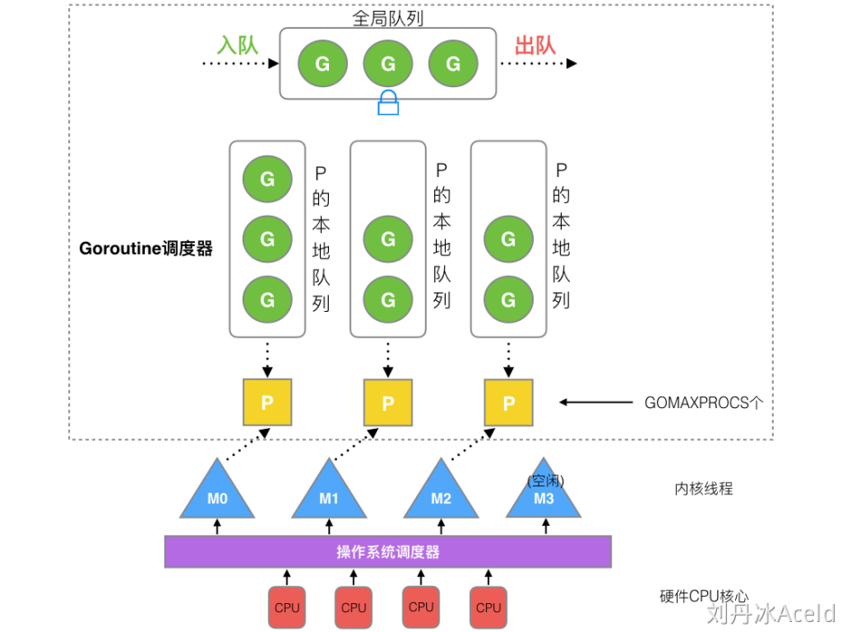
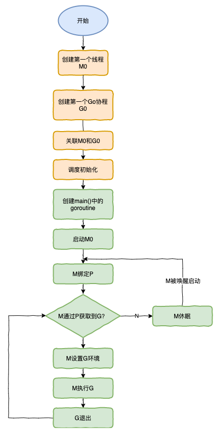

# GMP
## 一、调度器由来
单进程时代不需要调度器：程序串行执行，进程阻塞浪费CPU
多进程/线程时代：调度 cpu 的算法可以保证在运行的进程都可以被分配到 cpu 的运行时间片。这样从宏观来看，似乎多个进程是在同时被运行
线程由CPU调度是抢占式的，协程由用户态调度是协作式的
## 一、GMP

把大量的goroutine分配到少量的线程上去执行，利用多核并行，实现更强大的并发。

### 1、G(goroutine)

受go运行时管理的轻量级线程，使用go关键字创建，main函数也是一个goroutine。

每个goroutine都有自己的栈空间，定时器，初始化的栈空间在2k左右，空间会随着需求增长。

goroutine的新建, 休眠, 恢复, 停止都受到go运行时的管理。

goroutine执行异步操作时会进入休眠状态, 待操作完成后再恢复, 无需占用系统线程。

goroutine新建或恢复时会添加到运行队列, 等待M取出并运行。

### 2、M(machine)

抽象化代表内核线程，记录内核线程栈信息，当goroutine调度到线程时，使用该goroutine自己的栈信息。

系统线程，可运行两种代码：

- go代码，即goroutine，需要一个P。
- 原生代码，如阻塞的syscall，不需要P。

M会从运行队列中取出G, 然后运行G, 如果G运行完毕或者进入休眠状态, 则从运行队列中取出下一个G运行, 周而复始.

有时候G需要调用一些无法避免阻塞的原生代码, 这时M会释放持有的P并进入阻塞状态, 其他M会取得这个P并继续运行队列中的G.

go需要保证有足够的M可以运行G, 不让CPU闲着, 也需要保证M的数量不能过多.

M的状态

- 自旋线程：处于运行但没有可执行goroutine的线程，数量上限为GOMAXPROC
- 非自旋线程：处于运行状态有可执行goroutine的线程

G的主要几种状态：

- **_Gidle**：刚刚被分配并且还没有被初始化，值为0，为创建goroutine后的默
- **_Grunnable**： 没有执行代码，没有栈的所有权，存储在运行队列中，可能在某个P的本地队列或全局队列中(如上图)。
- **_Grunning**： 正在执行代码的goroutine，拥有栈的所有权(如上图)。
- **_Gsyscall**：正在执行系统调用，拥有栈的所有权，与P脱离，但是与某个M绑定，会在调用结束后被分配到运行队列(如上图)。
- **_Gwaiting**：被阻塞的goroutine，阻塞在某个channel的发送或者接收队列(如上图)。
- *_Gdead**： 当前goroutine未被使用，没有执行代码，可能有分配的栈，分布在空闲列表gFree，可能是一个刚刚初始化的goroutine，也可能是执行了goexit退出的goroutine(如上图)**_
- _Gcopystac**：栈正在被拷贝，没有执行代码，不在运行队列上，执行权在**_
- __Gscan** ： GC 正在扫描栈空间，没有执行代码，可以与其他状态同时存在

### 3、P(processor)

代表**调度器**，负责调度goroutine，维护一个本地goroutine队列，M从P上获得goroutine并执行，同时还负责部分内存的管理。

代表M运行G所需的资源，数量默认等于CPU核心数，可通过环境变量GOMAXPROC修改。

P的数量表示当前最多只有P个线程(M)执行Go代码，原生代码的线程数不受控制。

P的状态：

- **_Pidle** ：处理器没有运行用户代码或者调度器，被空闲队列或者改变其状态的结构持有，运行队列为空
- **_Prunning** ：被线程 M 持有，并且正在执行用户代码或者调度器(如上图)
- **_Psyscall**：没有执行用户代码，当前线程陷入系统调用(如上图)
- **_Pgcstop** ：被线程 M 持有，当前处理器由于垃圾回收被停止
- **_Pdead** ：当前处理器已经不被使用

## GMP模型
 线程是运行goroutine的实体，调度器的功能是把可运行的goroutine分配到工作线程上
 Goroutine调度器和OS调度器是通过M结合起来的，每个M都代表了1个内核线程，OS调度器负责把内核线程分配到CPU的核上执行。
 
1. 全局队列（Global Queue）：存放等待运行的G。
2. P的本地队列：同全局队列类似，存放的也是等待运行的G，存的数量有限，不超过256个。新建G'时，G'优先加入到P的本地队列（局部性调度设计，有利于内存访问命中率），如果队列满了，则会把本地队列中一半的G移动到全局队列。
3. P列表：所有的P都在程序启动时创建，并保存在数组中，最多有GOMAXPROCS(可配置)个。
4. M：线程想运行任务就得获取P，从P的本地队列获取G，P队列为空时，M也会尝试从全局队列拿一批G放到P的本地队列，或从其他P的本地队列偷一半放到自己P的本地队列。M运行G，G执行之后，M会从P获取下一个G，不断重复下去
## 设计策略
* 复用线程：避免频繁的创建、销毁线程，而是对线程的复用
* work stealing机制：当本线程无可运行的G时，先从全局队列获取G，没有则尝试从其他线程绑定的P偷取G，而不是销毁线程。
* hand off机制：当本线程因为G进行系统调用阻塞时，线程释放绑定的P，把P转移给其他空闲的线程执行
* 利用并行：GOMAXPROCS设置P的数量，最多有GOMAXPROCS个线程分布在多个CPU上同时运行
* 抢占：在coroutine中要等待一个协程主动让出CPU才执行下一个协程，在Go中，一个goroutine最多占用CPU 10ms，防止其他goroutine被饿死，这就是goroutine不同于coroutine的一个地方
* 全局G队列：在新的调度器中依然有全局G队列，但功能已经被弱化了，当M执行work stealing从其他P偷不到G时，它可以从全局G队列获取G。
## 调度流程
## 调度器生命周期

M0

M0是启动程序后的编号为0的主线程，这个M对应的实例会在全局变量runtime.m0中，不需要在heap上分配，M0负责执行初始化操作和启动第一个G， 在之后M0就和其他的M一样了。

G0

G0是每次启动一个M都会第一个创建的gourtine，G0仅用于负责调度的G，G0不指向任何可执行的函数, 每个M都会有一个自己的G0。在调度或系统调用时会使用G0的栈空间, 全局变量的G0是M0的G0。