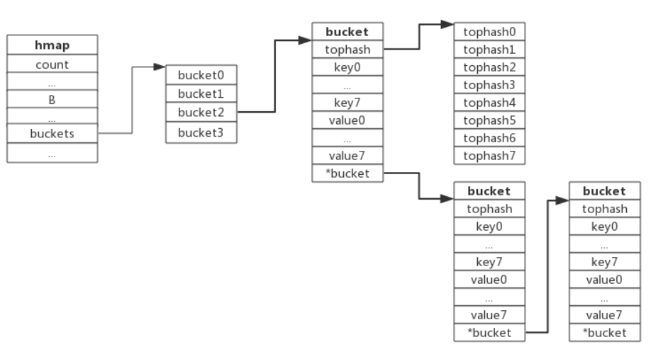
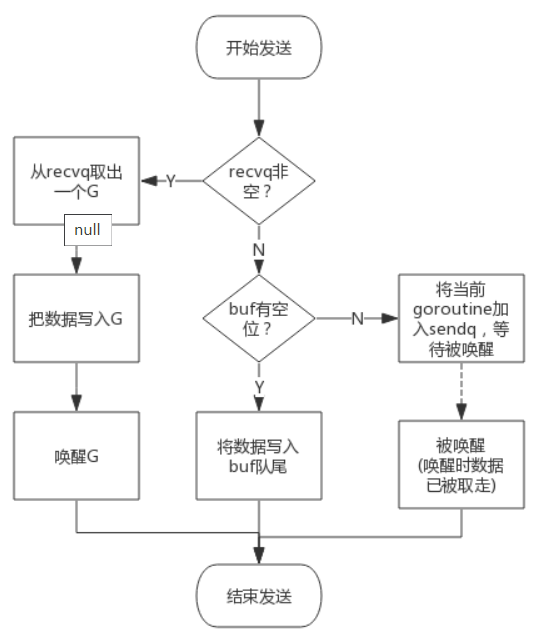
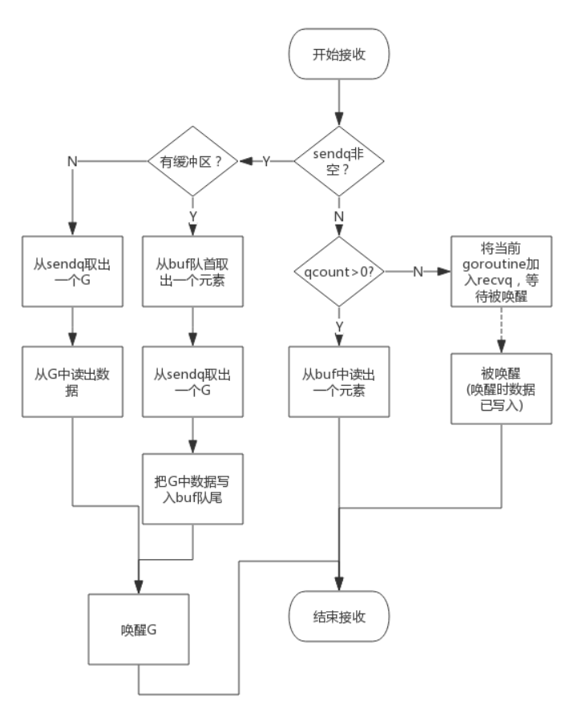

# 常见数据结构
## 数组
* 组成：由相同类型元素的集合
* 存储：一块连续的内存，编译器决定是否应该在堆上
* 访问：索引快速访问，复杂的O(1)
* 类型：元素类型+最大容量构成数组类型
* 
### 初始化
时间范围：数组的初始化是在编译期进行的，且在中间代码生成之前
```go
//显示指定数组大小
arr1 := [3]int{1, 2, 3}

//编译器通过源代码推导数组大小，与显式指定在运行期的结果一致
arr2 := [...]int{1, 2, 3}
```

字面量组成数组的初始化
* 当元素数量小于或者等于4个时，会直接将数组中的元素放置在栈上；
* 当元素数量大于4个时，会将数组中的元素放置到静态区，然后拷贝到栈上

数组和字符串的一些简单越界错误（常量访问下标）都会在编译期间发现


## slice
动态数组，依托数组实现，长度并不固定，可以向切片中追加元素，它会在容量不足时自动扩容
### 数据结构
Slice依托数组实现，底层数组对用户屏蔽，在底层数组容量不足时可以实现自动重分配并生成新的Slice
```go
type SliceHeader struct {
    //是指向数组的指针，一片连续的内存空间，这片内存空间可以用于存储切片中的全部元素
	Data uintptr
	//是当前切片的长度
	Len  int
	//是当前切片的容量，即 Data 数组的大小
	Cap  int
}
```
### 创建
* make：可以同时指定长度和容量，创建时底层会分配一个数组，数组的长度即容量
```go
slice := make([]int, 5, 10)
```
* 使用数组来创建Slice时，Slice将与原数组共用一部分内存
```
slice := array[5:7]
```

### 扩容
使用append向Slice追加元素时，如果Slice空间不足，将会触发Slice扩容，扩容实际上是重新分配一块更大的内存，将原Slice数据拷贝进新Slice，然后返回新Slice，扩容后再将数据追加进去

扩容原则：

* 如果期望容量大于当前容量的两倍就会使用期望容量；
* 如果当前切片的长度小于 1024 就会将容量翻倍；
* 如果当前切片的长度大于 1024 就会每次增加 25% 的容量，直到新容量大于期望容量
添加元素流程：

1. 假如Slice容量够用，则将新元素追加进去，Slice.len++，返回原Slice
2. 原Slice容量不够，则将Slice先扩容，扩容后得到新Slice
3. 将新元素追加进新Slice，Slice.len++，返回新的Slice

切片引入了一个抽象层，提供了对数组中部分连续片段的引用，可以在运行区间修改它的长度和范围。当切片底层的数组长度不足时就会触发扩容，切片指向的数组可能会发生变化，不过在上层看来切片是没有变化的，上层只需要与切片打交道不需要关心数组的变化
1. slice根据数组array创建，与数组共享存储空间

### 拷贝
copy()内置函数拷贝两个切片时，会将源切片的数据逐个拷贝到目的切片指向的数组中，拷贝数量取两个切片长度的最小值（copy过程中不会发生扩容）。
```go
copy(a, b)
```

### 总结
* 创建切片时可根据实际需要预分配容量，尽量避免追加过程中扩容操作，有利于提升性能
* 切片拷贝时需要判断实际拷贝的元素个数
* 谨慎使用多个切片操作同一个数组，以防读写冲突
* 每个切片都指向一个底层数组
* 每个切片都保存了当前切片的长度、底层数组可用容量
* 使用len()计算切片长度时间复杂度为O(1)，不需要遍历切片
* 使用cap()计算切片容量时间复杂度为O(1)，不需要遍历切片
* 使用append()向切片追加元素时有可能触发扩容，扩容后将会生成新的切片
* 通过切片创建切片时可通过限制容量保证创建新的切片
* 切片赋值和函数传参数是将切片头信息部分按传值方式处理。因为切片头含有底层数据的指针，所以它的赋值也不会导致底层数据的复制
* 切片中的底层数组部分是通过隐式指针传递(指针本身依然是传值的，但是指针指向的却是同一份的数据)，所以被调用函数是可以通过指针修改掉调用参数切片中的数据。除了数据之外，切片结构还包含了切片长度和切片容量信息，这2个信息也是传值的。如果被调用函数中修改了Len或Cap信息的话，就无法反映到调用参数的切片中，这时候我们一般会通过返回修改后的切片来更新之前的切片。这也是为何内置的append必须要返回一个切片的原因

通过slice实现栈
```go
stack = append(stack, v) //push
top = stack[len(stack)-1] //top
stack = stack[:len(stack)-1] //pop
```

## map
O(1)的读写性能
### 哈希函数
目标：结果能够尽可能的均匀分布，然后通过工程上的手段解决哈希碰撞的问题；结果不均匀的哈希函数会带来更多的哈希冲突以及更差的读写性能

### 数据结构
Golang的map使用哈希表作为底层实现，一个哈希表里可以有多个哈希表节点，也即bucket，而每个bucket就保存了map中的一个或一组键值对。
```go
//runtime/map.go:hmap
type hmap struct {
    //当前哈希表中的元素数量
	count     int
	
	flags     uint8
	
	//buckets数量,len(buckets) == 2^B
	B         uint8
	
	noverflow uint16
	
	//哈希种子,为哈希函数的结果引入随机性，创建哈希表时确定，调用哈希函数时作为参数传入
	hash0     uint32
	
    // bucket数组指针，数组的大小为2^B
	buckets    unsafe.Pointer
	
	//哈希在扩容时用于保存之前buckets的字段，它的大小是当前buckets的一半
	oldbuckets unsafe.Pointer
	
	nevacuate  uintptr

	extra *mapextra
}

type mapextra struct {
	overflow    *[]*bmap
	oldoverflow *[]*bmap
	nextOverflow *bmap
}

//bucket数据结构
type bmap struct {
    //存储哈希值的高8位
    tophash [8]uint8 
    
    ////key value数据
    data    byte[1]
    
    //溢出bucket的地址；指针指向的是下一个bucket，据此将所有冲突的键连接起来
    overflow *bmap   
}
```


bucket：桶，在内存中是连续存储的；可以存储存储 8 个键值对；
* nextOverflow：当桶中存储的数据过多，单个桶已经装满时就会使用 extra.nextOverflow 中桶存储溢出的数据

bmap：存储了键的哈希的高 8 位（tophash），通过比较不同键的哈希的高 8 位可以减少访问键值对次数以提高性能
### 冲突解决
#### 开放寻址法
底层的数据结构：数组
核心思想：依次探测和比较数组中的元素以判断目标键值对是否存在于哈希表中
装载因子：数组中元素的数量与数组大小的比值。随着装载因子的增加，线性探测的平均用时就会逐渐增加，这会影响哈希表的读写性能。当装载率超过 70% 之后，哈希表的性能就会急剧下降，而一旦装载率达到 100%，整个哈希表就会完全失效，这时查找和插入任意元素的时间复杂度都是 O(n) 
#### 拉链法
实现：数组+链表
具体过程：hash取模找桶，然后遍历桶地链表：
* 找到键相同的键值对，则更新键对应的值；
* 没有找到键相同的键值对；在链表的末尾追加新的键值对
装载因子：元素数量÷桶数量；在一般情况下装载因子都不会超过 1，当哈希表的装载因子较大时会触发哈希的扩容，创建更多的桶来存储哈希中的元素，保证性能不会出现严重的下降

#### GO
Go使用链地址法来解决键冲突。
由于每个bucket可以存放8个键值对，所以同一个bucket存放超过8个键值对时就会再创建一个键值对，用类似链表的方式将bucket连接起来
bucket数据结构指示下一个bucket的指针称为overflow bucket，意为当前bucket盛不下而溢出的部分。事实上哈希冲突并不是好事情，它降低了存取效率，好的哈希算法可以保证哈希值的随机性，但冲突过多也是要控制的

### 负载因子
负载因子用于衡量一个哈希表冲突情况
```
负载因子 = 键数量/bucket数量
```
* 哈希因子过小，说明空间利用率低
* 哈希因子过大，说明冲突严重，存取效率低
### 创建
1. 计算哈希占用的内存是否溢出或者超出能分配的最大值；
2. 调用 runtime.fastrand 获取一个随机的哈希种子；
3. 根据传入的 hint 计算出需要的最小需要的桶的数量；
4. 使用 runtime.makeBucketArray 创建用于保存桶的数组
* 当桶的数量小于 16 时，由于数据较少、使用溢出桶的可能性较低，会省略创建的过程以减少额外开销；
* 当桶的数量多于 16 时，会额外创建2的（B-4）次方个溢出桶

### 插入
1. 根据key值算出哈希值
2. 取哈希值低位与hmap.B取模确定bucket位置
3. 查找该key是否已经存在，如果存在则直接更新值
4. 如果没找到将key，将key插入

### 扩容
触发扩容：
* 负载因子已经超过 6.5；
* overflow数量 > 2^15时，也即overflow数量超过32768时

#### 增量扩容
负载因子过大时触发的扩容，由于一次性搬迁可能会造成比较大的延时，Go采用逐步搬迁策略，即每次访问map时都会触发一次搬迁，每次搬迁2个键值对。具体流程：

1. oldbuckets成员指身原bucket，而buckets指向了新申请的bucke
2. 新的键值对被插入新的bucket中
3. 后续对map的访问操作会触发迁移，将oldbuckets中的键值对逐步的搬迁过来。当oldbuckets中的键值对全部搬迁完毕后，删除oldbuckets
4. 数据搬迁过程中原bucket中的键值对将存在于新bucket的前面，新插入的键值对将存在于新bucket的后面

#### 等量扩容
实际上并不是扩大容量，buckets数量不变，重新做一遍类似增量扩容的搬迁动作，把松散的键值对重新排列一次，以使bucket的使用率更高，进而保证更快的存取
sameSizeGrow ：通过复用已有的哈希扩容机制解决该问题，一旦哈希中出现了过多的溢出桶，它会创建新桶保存数据，垃圾回收会清理老的溢出桶并释放内存

### 查找
1. 根据key值算出哈希值
2. 取哈希值低位与hmap.B取模确定bucket位置
3. 取哈希值高位在tophash数组中查询
4. 如果tophash[i]中存储值也哈希值相等，则去找到该bucket中的key值进行比较
5. 当前bucket没有找到，则继续从下个overflow的bucket中查找。
6. 如果当前处于搬迁过程，则优先从oldbuckets查找

## string
string是8比特字节的集合，通常是但并不一定非得是UTF-8编码的文本
存储：一片连续的只读的内存空间，可以看作一个由字符组成的数组

### 数据结构
```go
//src/runtime/string.go
type StringHeader struct {
    //字符串的首地址
	Data uintptr
	
    //字符串的长度
	Len  int
}
```

### 声明
双引号：单行字符串的初始化,内部出现双引号，需要使用 \ 符号避免编译器的解析错误
```go
str1 := "this is a string"

```
go语言处理逻辑
* 使用双引号表示开头和结尾；
* 需要使用反斜杠 \ 来逃逸双引号；
* 不能出现如下所示的隐式换行 \n；
反引号：反引号声明的字符串可以摆脱单行的限制。当使用反引号时，因为双引号不再负责标记字符串的开始和结束，我们可以在字符串内部直接使用 "
```go
str2 := `this is another
string`

json := `{"author": "draven", "tags": ["golang"]}`
```
### 拼接
一个拼接语句的字符串编译时都会被存放到一个切片中，拼接过程需要遍历两次切片，第一次遍历获取总的字符串长度，据此申请内存，第二次遍历会把字符串逐个拷贝过去。伪代码如下：
```go
//字符串拼接
func concatstrings(a []string) string { 
    //拼接后总的字符串长度
    length := 0        

    //获取总的字符串长度
    for _, str := range a {
        length += len(str)
    }

    // 生成指定大小的字符串，返回一个string和切片，二者共享内存空间
    s, b := rawstring(length) 

    // string无法修改，只能通过切片修改
    for _, str := range a {
        copy(b, str)    
        b = b[len(str):]
    }

    return s
}
```
因为string是无法直接修改的，所以这里使用rawstring()方法初始化一个指定大小的string，同时返回一个切片，二者共享同一块内存空间，后面向切片中拷贝数据，也就间接修改了string

### 类型转换
Go 语言解析和序列化 JSON 等数据格式时，经常需要将数据在 string 和 []byte 之间来回转换
#### []byte转string
1. 根据切片的长度申请内存空间，假设内存地址为p，切片长度为len(b)；
2. 构建string（string.str = p；string.len = len；）
3. 拷贝数据(切片中数据拷贝到新申请的内存空间)

#### string转[]byte
1. 申请切片内存空间
2. 将string拷贝到切片

#### 对比
* 内容一样
* 字符串只读；[]byte可读写
* 无论从哪种类型转换到另一种都需要拷贝数据

#### 使用场景
string 擅长的场景：

* 需要字符串比较的场景；
* 不需要nil字符串的场景；

[]byte擅长的场景：

* 修改字符串的场景，尤其是修改粒度为1个字节；
* 函数返回值，需要用nil表示含义的场景；
* 需要切片操作的场景；

### 修改
Go的实现中，string不包含内存空间，只有一个内存的指针，这样做的好处是string变得非常轻量，可以很方便的进行传递而不用担心内存拷贝
因为string通常指向字符串字面量，而字符串字面量存储位置是只读段，而不是堆或栈上，所以才有了string不可修改的约定

强制修改：
1. 先将这段内存拷贝到堆或者栈上；
2. 将变量的类型转换成 []byte 后并修改字节数据；
3. 将修改后的字节数组转换回 string


## channel
channel主要用于进程内各goroutine间通信
### 数据结构
src/runtime/chan.go:hchan定义了channel的数据结构：
```go
type hchan struct {
    qcount   uint           // 当前队列中剩余元素个数
    dataqsiz uint           // 环形队列长度，即可以存放的元素个数
    buf      unsafe.Pointer // 环形队列指针
    elemsize uint16         // 每个元素的大小
    closed   uint32            // 标识关闭状态
    elemtype *_type         // 元素类型
    sendx    uint           // 队列下标，指示元素写入时存放到队列中的位置
    recvx    uint           // 队列下标，指示元素从队列的该位置读出
    recvq    waitq          // 等待读消息的goroutine队列
    sendq    waitq          // 等待写消息的goroutine队列
    lock mutex              // 互斥锁，chan不允许并发读写
}
```
* 环形队列作为缓冲区，队列的长度是创建chan时指定

### 写
1. 如果等待接收队列recvq不为空，说明缓冲区中没有数据或者没有缓冲区，此时直接从recvq取出G,并把数据写入，最后把该G唤醒，结束发送过程；
2. 如果缓冲区中有空余位置，将数据写入缓冲区，结束发送过程；
3. 如果缓冲区中没有空余位置，将待发送数据写入G，将当前G加入sendq，进入睡眠，等待被读goroutine唤醒

### 读
1. 如果等待发送队列sendq不为空，且没有缓冲区，直接从sendq中取出G，把G中数据读出，最后把G唤醒，结束读取过程；
2. 如果等待发送队列sendq不为空，此时说明缓冲区已满，从缓冲区中首部读出数据，把G中数据写入缓冲区尾部，把G唤醒，结束读取过程；
3. 如果缓冲区中有数据，则从缓冲区取出数据，结束读取过程；
4. 将当前goroutine加入recvq，进入睡眠，等待被写goroutine唤醒；


### 关闭
关闭channel时会把recvq中的G全部唤醒，本该写入G的数据位置为nil。把sendq中的G全部唤醒，但这些G会panic。

除此之外，panic出现的常见场景还有：
* 关闭值为nil的channel
* 关闭已经被关闭的channel
* 向已经关闭的channel写数据

### 使用
1. 单向channel：通过函数传参对channel的一种使用限制
2. select：select的case语句读channel不会阻塞，尽管channel中没有数据。这是由于case语句编译后调用读channel时会明确传入不阻塞的参数，此时读不到数据时不会将当前goroutine加入到等待队列，而是直接返回
3. range：通过range可以持续从channel中读出数据，好像在遍历一个数组一样，当channel中没有数据时会阻塞当前goroutine，与读channel时阻塞处理机制一样。如果向此channel写数据的goroutine退出时，系统检测到这种情况后会panic，否则range将会永久阻塞
### 总结
* 从channel读数据，如果channel缓冲区为空或者没有缓冲区，当前goroutine会被阻塞
* 向channel写数据，如果channel缓冲区已满或者没有缓冲区，当前goroutine会被阻塞
* 因读阻塞的goroutine会被向channel写入数据的goroutine唤醒
* 因写阻塞的goroutine会被从channel读数据的goroutine唤醒
● 给一个 nil channel 发送数据，造成永远阻塞 
●  从一个 nil channel 接收数据，造成永远阻塞 
●  给一个已经关闭的 channel 发送数据，引起 panic 
●  从一个已经关闭的 channel 接收数据，如果缓冲区中为空，则返回一个零值 
●  无缓冲的channel是同步的，而有缓冲的channel是非同步的 
口诀：空读写阻塞，写关闭异常，读关闭空零”
## struct
Go的struct声明允许字段附带Tag来对字段做一些标记
常见的tag用法，主要是JSON数据解析、ORM映射等
## iota
常用于const表达式中，我们还知道其值是从零开始，const声明块中每增加一行iota值自增1
规则：
1. iota在const关键字出现时被重置为0
2. const声明块中每新增一行iota值自增1
3. iota代表了const声明块的行索引（下标从0开始）
4. 第一个常量必须指定一个表达式，后续的常量如果没有表达式，则继承上面的表达式
```go
const (
    //bit0 == 1，mask0 == 0
    bit0, mask0 = 1 << iota, 1<<iota - 1
    
    //bit1 == 2，mask1 == 1
    bit1, mask1 
                          
    _, _    
    
    //bit0 == 8，mask0 == 7
    bit3, mask3 
)
```