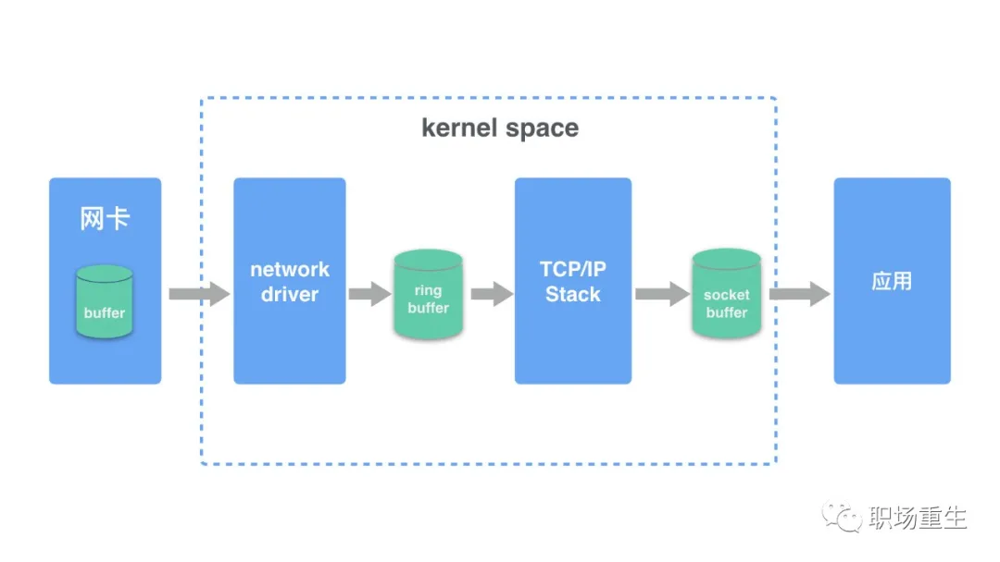

#命令行

1. cd
```
$ cd /home         进入 '/ home' 目录
$ cd ..            返回上一级目录 
$ cd ../..         返回上两级目录 
$ cd               进入个人的主目录 
$ cd ~user1        进入个人的主目录 
$ cd -             返回上次所在的目录
```

## 2. pwd
显示工作路径

## 3. ls
```
$ ls 查看目录中的文件 
$ ls -l 显示文件和目录的详细资料 
$ ls -a 列出全部文件，包含隐藏文件
$ ls -R 连同子目录的内容一起列出（递归列出），等于该目录下的所有文件都会显示出来  
$ ls [0-9] 显示包含数字的文件名和目录名
```


## 4. cp
```
$ -a ：将文件的特性一起复制
$ -p ：连同文件的属性一起复制，而非使用默认方式，与-a相似，常用于备份
$ -i ：若目标文件已经存在时，在覆盖时会先询问操作的进行
$ -r ：递归持续复制，用于目录的复制行为录下的所有文件都会显示出来  
$ -u ：目标文件与源文件有差异时才会复制
```

## 5.  mv
```
$ -f ：force强制的意思，如果目标文件已经存在，不会询问而直接覆盖
$ -i ：若目标文件已经存在，就会询问是否覆盖-a相似，常用于备份
$ -u ：若目标文件已经存在，且比目标文件新，才会更新进行 
```
## 6. rm
```
$ -f ：就是force的意思，忽略不存在的文件，不会出现警告消息
$ -i ：互动模式，在删除前会询问用户是否操作
$ -r ：递归删除，最常用于目录删除，它是一个非常危险的参数
```
## 7. cat
```
$ cat file1 从第一个字节开始正向查看文件的内容 
$ tac file1 从最后一行开始反向查看一个文件的内容 
$ cat -n file1 标示文件的行数 
$ more file1 查看一个长文件的内容 
$ head -n 2 file1 查看一个文件的前两行 
$ tail -n 2 file1 查看一个文件的最后两行 
$ tail -n +1000 file1  从1000行开始显示，显示1000行以后的
$ cat filename | head -n 3000 | tail -n +1000  显示1000行到3000行
$ cat filename | tail -n +3000 | head -n 1000  从第3000行开始，显示1000(即显示3000~3999行)
```

## 7. find
```
$ find / -name file1 从 '/' 开始进入根文件系统搜索文件和目录 
$ find / -user user1 搜索属于用户 'user1' 的文件和目录 
$ find /usr/bin -type f -atime +100 搜索在过去100天内未被使用过的执行文件 
$ find /usr/bin -type f -mtime -10 搜索在10天内被创建或者修改过的文件 
$ whereis halt 显示一个二进制文件、源码或man的位置 
$ which halt 显示一个二进制文件或可执行文件的完整路径
```

## 7. chmod
## 7. chown
## 7. chgrp
## 7. grep

## 7. paste
```
$ paste file1 file2 合并两个文件或两栏的内容 
$ paste -d '+' file1 file2 合并两个文件或两栏的内容，中间用"+"区分
```
## 7. sort
```
$ sort file1 file2 排序两个文件的内容 文件，不会出现警告消息
$ sort file1 file2 | uniq 取出两个文件的并集(重复的行只保留一份) 作
$ sort file1 file2 | uniq -u 删除交集，留下其他的行 
$ sort file1 file2 | uniq -d 取出两个文件的交集(只留下同时存在于两个文件中的文件)
```

## 7. comm
```
$ comm -1 file1 file2 比较两个文件的内容只删除 'file1' 所包含的内容 rce的意思，忽略不存在的文件，不会出现警告消息
$ comm -2 file1 file2 比较两个文件的内容只删除 'file2' 所包含的内容 ，在删除前会询问用户是否操作
$ comm -3 file1 file2 比较两个文件的内容只删除两个文件共有的部分
```
## 7. tar
```
$ 压缩：tar -jcv -f filename.tar.bz2 要被处理的文件或目录名称 file1.rar test_file 创建一个叫做 'file1.rar' 的包 
$ 查询：tar -jtv -f filename.tar.bz2 file1.rar file1 file2 dir1 同时压缩 'file1', 'file2' 以及目录 'dir1' 
$ 解压：tar -jxv -f filename.tar.bz2 -C 欲解压缩的目录
```

## 7. rar
```
$ rar a file1.rar test_file 创建一个叫做 'file1.rar' 的包 
$ rar a file1.rar file1 file2 dir1 同时压缩 'file1', 'file2' 以及目录 'dir1' 
$ rar x file1.rar 解压rar包
```

## 7. zip
```
$ zip file1.zip file1 创建一个zip格式的压缩包 
$ unzip file1.zip 解压一个zip格式压缩包 
$ zip -r file1.zip file1 file2 dir1 将几个文件和目录同时压缩成一个zip格式的压缩包
```

## 7. sort

## 1、cloc代码统计工具
```
$ cloc thallo
```

## 2、查看端口号
```
$ netstat -tunlp|grep
```
