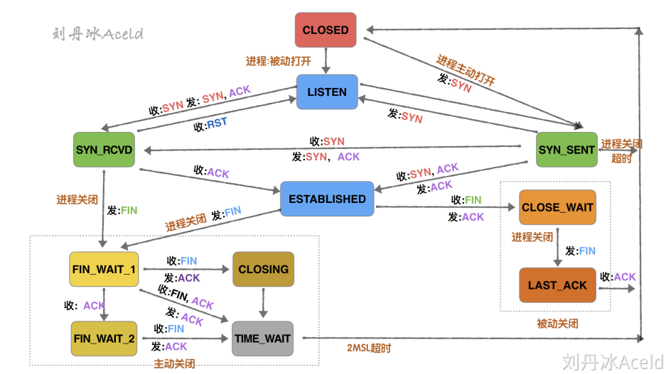
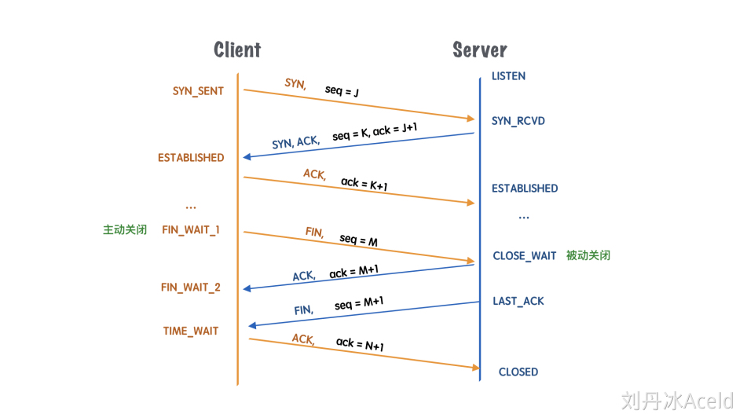

# TCP
## TIME_WAIT

一次完整的TCP通信流程：

client的TIME_WAIT状态：告诉server，自己没有需要发送的数据，但是它仍然保持了接收对方数据的能力

关闭连接过程：
1. 当客户端没有待发送的数据时，它会向服务端发送 FIN 消息，发送消息后会进入 FIN_WAIT_1 状态；

2. 服务端接收到客户端的 FIN 消息后，会进入 CLOSE_WAIT 状态并向客户端发送 ACK 消息，客户端接收到 ACK 消息时会进入 FIN_WAIT_2 状态；
3. 当服务端没有待发送的数据时，服务端会向客户端发送 FIN 消息；
4. 客户端接收到 FIN 消息后，会进入 TIME_WAIT 状态并向服务端发送 ACK 消息，服务端收到后会进入 CLOSED 状态；
5. 客户端等待两个最大数据段生命周期（Maximum segment lifetime，MSL）的时间后也会进入 CLOSED 状态

### 作用
TIME_WAIT一定是发生在主动关闭一方，被动关闭一方，会直接进入CLOSED状态，而主动关闭一方需要等待2*MSL时间才会最终关闭
* 防止被动关闭方的延迟数据被人窃取：保证到client端的延迟数据彻底消散于网络，避免被同服务器重用端口服务获取
* 防止被动关闭方没有收到最后的ACK：此时server端将一直处于LAST_ACK状态，导致如果client端重启连接会被RST

如果客户端等待足够长的时间就会遇到以下两种情况：
1. 服务端正常收到了 ACK 消息并关闭当前 TCP 连接；
2. 服务端没有收到 ACK 消息，重新发送 FIN 关闭连接并等待新的 ACK 消息