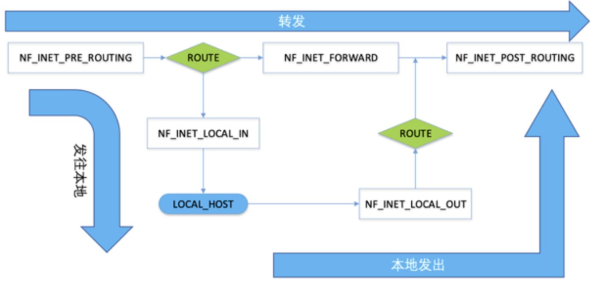
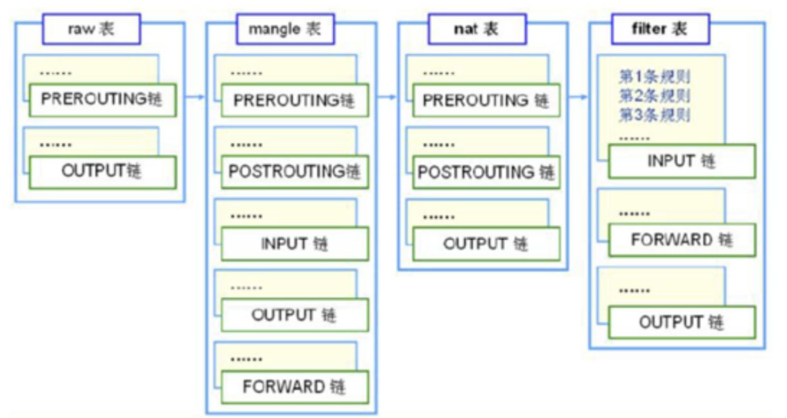

# Neifilter
netfilter是linux内核中的一个数据包处理框架，用于替代原有的ipfwadm和ipchains等数据包处理程序。netfilter的功能包括数据包过滤，修改，SNAT/DNAT等。netfilter在内核协议栈的不同位置实现了5个hook点，其它内核模块(比如ip_tables)可以向这些hook点注册处理函数，这样当数据包经过这些hook点时，其上注册的处理函数就被依次调用，用户层工具像iptables一般都需要相应内核模块ip_tables配合以完成与netfilter的交互。netfilter hooks、ip{6}_tables、connection tracking、和NAT子系统一起构成了netfilter框架的主要部分

## Netfilter框架
* 数据包处理框架
* 功能：数据包过滤、修改、SNAT、DNAT等
* 实现：


* bridge level：ebtables的表和链，只工作在链路层，处理的是以太网帧(比如修改源目mac地址)
* network level：iptables的表和链,只处理IP数据包
* conntrack：connection tracking，netfilter提供的连接跟踪机制，此机制允许内核”审查”通过此处的所有网络数据包，并能识别出此数据包属于哪个网络连接，使内核能够跟踪并记录通过此处的所有网络连接及其状态
* bridge check：数据包从某个网络接口进入(ingress),检查此接口是否属于某个Bridge的port，如果是就会进入Bridge代码处理逻辑(下方蓝色区域bridge level), 否则就会送入网络层Network Layer处理
* bridging decision类似普通二层交换机的查表转发功能，根据数据包目的MAC地址判断此数据包是转发还是交给上层处理
    1. 包目的MAC为Bridge本身MAC地址(当br0设置有IP地址)，从MAC地址这一层来看，收到发往主机自身的数据包，交给上层协议栈(D –> J)
    2. 广播包，转发到Bridge上的所有接口(br0,tap0,tap1,tap…)
    3. 单播&&存在于MAC端口映射表，查表直接转发到对应接口(比如 D –> E)
    4. 单播&&不存在于MAC端口映射表，泛洪到Bridge连接的所有接口(br0,tap0,tap1,tap…)
    5. 数据包目的地址接口不是网桥接口，桥不处理，交给上层协议栈(D –> J)
* routing decision：路由选择，根据系统路由表(ip route查看), 决定数据包是forward，还是交给本地处理

针对 IPv4 协议 iptables，IPv6 协议的 ip6tables，针对 ARP 协议的 arptables，针对网桥控制的 ebtables，针对网络连接追踪的 conntrack 等等

## hook点
netfilter在内核协议栈的不同位置实现了5个hook点，其它内核模块(比如ip_tables)可以向这些hook点注册处理函数，这样当数据包经过这些hook点时，其上注册的处理函数就被依次调用


发往本地：NF_INET_PRE_ROUTING-->NF_INET_LOCAL_IN
转发：NF_INET_PRE_ROUTING-->NF_INET_FORWARD-->NF_INET_POST_ROUTING
本地发出：NF_INET_LOCAL_OUT-->NF_INET_POST_ROUTING
```c
//referer: include/uapi/linux/netfilter.h#L46
enum nf_inet_hooks {
	NF_INET_PRE_ROUTING,
	NF_INET_LOCAL_IN,
	NF_INET_FORWARD,
	NF_INET_LOCAL_OUT,
	NF_INET_POST_ROUTING,
	NF_INET_NUMHOOKS
};
```
注册和解注册钩子函数
```c
// referer:/include/linux/netfilter.h
int nf_register_hook(struct nf_hook_ops *reg);
void nf_unregister_hook(struct nf_hook_ops *reg);
int nf_register_hooks(struct nf_hook_ops *reg, unsigned int n);
void nf_unregister_hooks(struct nf_hook_ops *reg, unsigned int n);
```
### NF_IP_PRE_ROUTING
### NF_IP_FORWARD
### NF_IP_POST_ROUTING
### NF_IP_LOCAL_IN
### NF_IP_LOCAL_OUT

## conntrack

iptables实现状态匹配(-m state)以及NAT的基础，它由单独的内核模块nf_conntrack实现
Hook点：PREROUTING、OUTPUT
作用：对于每个通过conntrack的数据包,内核都为其生成一个conntrack条目用以跟踪此连接,对于后续通过的数据包,内核会判断若此数据包属于一个已有的连接,则更新所对应的conntrack条目的状态(比如由原来的NEW状态变为ESTABLISHED状态),否则内核会为它新建一个conntrack条目.所有的conntrack条目都存放在一张表里,成为连接跟踪表.

### 连接跟踪表
查看系统是否存在conntrack模块
```shell
$ sysctl -a | grep conntrack
```

查看连接追踪表
```shell
#centos
$ cat /proc/net/nf_conntrack

#ubuntu
$ apt install conntrack
$ conntrack -L -o extend
```

在内核中,连接跟踪表是一个二维数组结构的哈系表(hash table),哈系表的大小记做HASHSIZE,哈系表的每一项(hash table entry)称作bucket,因此哈系表中有HASHSIZE个bucket存在.每个bucket包含一个链表(linked list),每个链表能够存放若干个conntrack条目(bucket size).对于一个新收到的数据包,内核使用如下步骤判断其是否属于一个已有的连接.

1. 内核提取次数据包信息(源目的IP,Port,协议号)进行Hash计算得到一个Hash值,在哈系表中以此Hash计算做索引,索引结果为数据包所属的bucket(链表).这一步hash计算时间固定并且很短
2. 遍历hash得到的bucket查找是否有匹配的conntrack条目.bucket size越大,遍历时间越长

### 最大连接追踪数
系统最大允许连接跟踪数 CONNTRACK_MAX = 连接跟踪表大小(HASHSIZE)*Bucket大小(buecket size)
从连接跟踪表获取bucket是hash操作时间很短,而遍历bucket相对费时,因此为了conntrack性能考虑,bucket size越小越好。

由于bucket size不能直接设置,为了是bucket size值为8,我们需要同时设置 CONNTRACK_MAX和 HASHSIZE,因为他们的比值就是bucket size.

```shell
#查看系统当前最大连接跟踪数CONNTRACK_MAX
sysctl -a | grep net.netfilter.nf_conntrack_max
#net.netfilter.nf_conntrack_max = 3203072

#查看当前连接跟踪表大小HASHSIZE
sysctl -a | grep net.netfilter.nf_conntrack_buckets
#400384
#或者这样
cat /sys/module/nf_conntrack/parameters/hashsize
#400384    

#HASHSIZE (内核会自动格式化为最接近允许值)       
echo 400000 > /sys/module/nf_conntrack/parameters/hashsize

#系统最大连接跟踪数
sysctl -w net.netfilter.nf_conntrack_max=3200000      

#注意nf_conntrack内核模块需要加载    
```

### 内存占用
连接跟踪表存储在系统内存中,因此需要考虑内存占用问题,
```shell
total_mem_used(bytes) = CONNTRACK_MAX * sizeof(struct ip_conntrack) + HASHSIZE * sizeof(struct list_head)
```
例如,在默认情况下,最大连接跟踪数是262144,hashsize是65535.在测试ubuntu18.04上面,sizeof(struct ip_conntrack) 是376,sizeof(struct list_head)是16. 所以: total_mem_used=262144*376+65535*16=99614704,约为9MB.

### conntrack条目
```shell
$ ipv4 2 tcp 6 431916 SYN_SENT src=172.22.44.167 dst=172.22.44.196 sport=44972 dport=18012  [UNREPLIED]  src=172.22.44.196 dst=172.22.44.167 sport=18012 dport=44972 mark=0 zone=0 use=2.
```
* ipv4,此连接使用的是ipv4的协议
* 2 表示ipv4的网络层协议编号是2,参考 include/linux/socket.h中对所有的网络层协议号的定义.
* tcp, 表示一个tcp连接
* 6, 是tcp的协议编号 参考 /include/uapi/linux/in.h 中对所有的传输层协议号的定义
* 431916, 是这条conntrack条目在当时时间点的生存时间/过期时间.(每个conntrack都会有生存时间,从设置值开始倒计时没倒计时完成后此条目将被清除).查看超时设置 中可以查看conntrack为所有的协议设置的超时时间.若后续有收到属于此连接的数据包,则此生存时间将被重置(重新从设置值开始倒计时,并且状态改变),生存时间设置值也会相应改为新状态的值.
* SYN_SENT, 是到此刻为止conntrack跟踪到的这个连接的状态(内核角度),SYN_SENT表示这个连接只在一个方向发欧式你关了一个初始TCP SYN包,还未看到响应的SYN+ACK(只有tcp才会有这个字段)
* src=172.22.44.167 dst=172.22.44.196 sport=44972 dport=18012 是从数据包中提取的源目地址,源目端口,是conntrack首次看到次数据包时候的信息.
* [UNREPLIED] 说明此刻为止,这个连接还没有收到任何响应,当一个连接已经收到响应, [UNREPLIED] 标志就会被移除
* 接下来的src=172.22.44.196 dst=172.22.44.167 sport=18012 dport=44972 和前面的地址端口是相反的.这部分不是数据包中带有的信息,是conntrack填充的信息,代表conntrack希望收到的响应表信息.若后续conntrack跟踪到某个数据包信息与此部分匹配,则此数据包就是此链接的响应数据包.注意这部分确定了conntrack如何判断响应包(tcp/udp),icmp是依据另外几个字段.

conntrack机制并不能够修改或过滤数据包,它只是更正网络连接并维护链接跟踪表,以提供给iptables做状态匹配使用,也就是说,如果你iptables中用不到状态匹配,那就没有必要启用conntrack.

### iptables的状态匹配
iptables是带有状态的防火墙,它使用-m state模块从链接跟踪表查找数据包状态.

1. NEW: 匹配连接的第一个包,判断此包是某连接的第一个包是依据conntrack当前”只看到一个方向数据包”([UNREPLIED])，不关联特定协议，因此NEW并不单指tcp连接的SYN包
2. ESTABLISHED:匹配连接的响应包及后续的包;iptables从连接跟踪表中查到此包是属于一个已经收到响应的连接(即没有[UNREPLIED]字段)。因此在iptables状态中，只要发送并接到响应，连接就认为是ESTABLISHED的了。这个特点使iptables可以控制由谁发起的连接才可以通过，比如A与B通信，A发给B数据包属于NEW状态，B回复给A的数据包就变为ESTABLISHED状态。ICMP的错误和重定向等信息包也被看作是ESTABLISHED，只要它们是我们所发出的信息的应答。
3. RELATED:当一个连接与另一个已经是ESTABLISHED的连接有关时，这个连接就被认为是RELATED。这意味着，一个连接要想成为RELATED，必须首先有一个已经是ESTABLISHED的连接存在。这个ESTABLISHED连接再产生一个主连接之外的新连接，这个新连接就是RELATED状态了，当然首先conntrack模块要能”读懂”它是RELATED。拿ftp来说，FTP数据传输连接就是RELATED与先前已建立的FTP控制连接，还有通过IRC的DCC连接。有了RELATED这个状态，ICMP错误消息、FTP传输、DCC等才能穿过防火墙正常工作。有些依赖此机制的TCP协议和UDP协议非常复杂，他们的连接被封装在其它的TCP或UDP包的数据部分(可以了解下overlay/vxlan/gre)，这使得conntrack需要借助其它辅助模块才能正确”读懂”这些复杂数据包，比如nf_conntrack_ftp这个辅助模块
4. INVALID匹配那些无法识别或没有任何状态的数据包。这可能是由于系统内存不足或收到不属于任何已知连接的ICMP错误消息。一般情况下我们应该DROP此类状态的包
5. UNTRACKED状态比较简单，它匹配那些带有NOTRACK标签的数据包。需要注意的一点是，如果你在raw表中对某些数据包设置有NOTRACK标签，那上面的4种状态将无法匹配这样的数据包，因此你需要单独考虑NOTRACK包的放行规则

### 相关命令
```shell
# 显示所有的conntrack条目
$ conntrack -L

# 过滤信息
$ conntrack -L -p tcp --dport 34856

# 更新mark字段
$conntrack -U -p tcp --port 3486 --mark 10

#清除连接跟踪表
$ conntrack -F

#删除连接跟踪表中所有源地址是1.2.3.4的条目
$ conntrack -D -s 1.2.3.4

```
## NAT
NAT（Network Address Translation）：

## iptables

### 表

#### filter
作用：数据包过滤和拦截作用
包含 INPUT，FORWARD 和 OUTPUT 三个链
INPUT 链是在NF_INET_LOCAL_IN节点，FORWARD 链是在NF_INET_FORWARD节点，OUTPUT 链则是在NF_INET_LOCAL_OUT节点
#### nat
#### mangle
#### raw

### 命令
```shell
iptables -t filter -A INPUT -s 172.16.0.0/16 -p udp --dport 53 -j DROP
```

